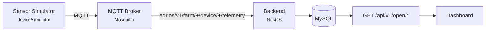

# OpenAgriOS

[](CHANGELOG.md)
[](LICENSE)
[](docker-compose.yml)
[](docs/RELEASE-AUDIT-v0.1-alpha.md)
[](docs/RELEASE-AUDIT-v0.1-alpha.md)

<!--
  Badge placeholders: the Release/License/Docker/Status badges above are static (shields.io
  "static badge" syntax) and render correctly with no GitHub repo behind them yet. The Build
  badge is intentionally "not yet configured" -- there is no CI workflow in this release (see
  docs/RELEASE-AUDIT-v0.1-alpha.md, Known Limitations). Once this repo is pushed and CI exists,
  replace it with a live workflow badge, e.g.:
  [](https://github.com/<org>/<repo>/actions/workflows/ci.yml)
-->

**v0.1-alpha** — an open-source Farm Digital Twin Platform built on IoT and MQTT.

Physical farm objects become digital entities you can see, query, and eventually act on:

```
Farm -> Field -> Device -> Sensor reading (Telemetry) -> Dashboard
```

This alpha release demonstrates the full loop with zero hardware required: **Sensor data → MQTT →
Platform → Visualization.**

## Why OpenAgriOS exists

Precision agriculture works, but it is locked behind subscriptions few farms can justify. A
300&nbsp;mu (~20 hectare) family farm — the scenario this project validates against, in Jingshan,
China — is too small for enterprise ag-tech budgets and too large to run on memory and guesswork.

- **Cost.** Self-hostable, not a per-farm SaaS subscription.
- **Data ownership.** Farm telemetry lives on infrastructure the farm or cooperative controls, not
  a closed vendor cloud.
- **Adaptability.** Soil, crop, and regulatory context vary by region — a closed platform can't be
  forked per-region; an open one can.
- **Longevity.** An irrigation system needs to run for a decade. A vendor can shut down; a
  maintained open project outlives any single company.

Full positioning, target users, and the case for open source: see
[`docs/architecture.md`](docs/architecture.md).

## Architecture (v0.1-alpha)



Every arrow above is real and running in this release. Full component map, the MQTT contract, and
why this reuses the existing AgriOS backend instead of a rewrite:
[`docs/architecture.md`](docs/architecture.md) ·
[`docs/mqtt-spec.md`](docs/mqtt-spec.md) ·
[`docs/AUDIT.md`](docs/AUDIT.md).

## Quick start

```bash
git clone <this repository's URL>
cd <the cloned directory>
docker compose up
```

(The clone folder is named after whatever this repository is published as — this codebase's local
directory is still named `AgriOS` pending the public rename to `OpenAgriOS`; `docker compose up`
works from either name, since `docker-compose.yml` doesn't depend on the containing folder's
name.)

Then open **http://localhost:8080**.

That single command starts MySQL, an MQTT broker, the backend (schema applied and the demo farm
seeded automatically), a hardware-free sensor simulator, and the dashboard. No manual database
setup, no account to create — the dashboard's read API is intentionally public for this alpha (see
[`docs/AUDIT.md`](docs/AUDIT.md) for why).

First boot takes under a minute. To stop everything: `docker compose down` (add `-v` to also wipe
the demo database).

### Running pieces without Docker

- Backend: `cd apps/backend && npm install && npm run start:dev` (needs a local MySQL + Mosquitto — see `infra/docker/docker-compose.yml`)
- Simulator: `cd device/simulator && npm install && npm start`
- Dashboard: open `apps/dashboard/index.html` directly, or serve the folder with any static file server

## Demo description

Once running, the dashboard shows the seeded demo farm updating live, every 5 seconds:

| | |
|---|---|
| Farm | Jingshan Farm |
| Field | Onion Field 01 |
| Device | sensor-001 |
| Soil Moisture | ~35% (fluctuating live) |
| Temperature | ~28°C (fluctuating live) |
| Humidity | ~70% (fluctuating live) |
| Status | Online |

The values move because `device/simulator` is a real MQTT publisher, not a static fixture — the
whole point is that nothing on screen is hardcoded. Stop the simulator and the device flips to
Offline within ~30 seconds; drop the simulated battery below 15% or soil moisture below 20% and an
alert appears.

## Screenshots

> Placeholder — this release was verified against the running Docker stack (API responses,
> ingestion logs, service health; see [`docs/RELEASE-AUDIT-v0.1-alpha.md`](docs/RELEASE-AUDIT-v0.1-alpha.md)
> "Deployment verification") but a rendered browser screenshot was not captured in this
> environment. Before or shortly after the public release, add:
>
> - `docs/screenshots/dashboard.png` — the main dashboard at `http://localhost:8080` after
>   `docker compose up`, showing the farm → field → device breadcrumb and live telemetry cards
> - `docs/screenshots/dashboard-alert.png` — the dashboard with an open alert visible (trigger one
>   by editing `device/simulator/simulator.js`'s baseline battery/soil-moisture values down past
>   the thresholds in `docs/mqtt-spec.md`)
>
> then replace this block with:
>
> ```markdown
> 
> ```

## What this release is, and isn't

This is a minimal, public, unauthenticated slice of a much larger, already-mature backend — not a
smaller rewrite of it. The full platform (safety-gated device control, ThingsBoard sync, GIS, drone
data import, irrigation engineering, multi-tenant auth) already exists and continues to run
untouched for authenticated users; see [`docs/DEVELOPMENT_LOG.md`](docs/DEVELOPMENT_LOG.md) for its
history. v0.1-alpha deliberately does **not** include AI/LLM decision-making, valve/pump control,
LoRa/ESP32 firmware, multi-tenancy, or complex auth on the new demo endpoints — see
[`ROADMAP.md`](ROADMAP.md) for what's next and why those are sequenced later.

## Roadmap

- **Now — v0.1-alpha:** this release.
- **Phase 2:** ESP32 support, LoRa sensors, real hardware integration.
- **Phase 3:** Edge agent, offline operation, gateway support.
- **Phase 4:** AI agriculture assistant, prediction, decision support.
- **Phase 5:** Verified automatic control loop, smart irrigation.

Full roadmap with scope notes: [`ROADMAP.md`](ROADMAP.md).

## Contributing

See [`CONTRIBUTING.md`](CONTRIBUTING.md). Start with [`docs/AUDIT.md`](docs/AUDIT.md) to understand
what's already built before proposing changes.

## License

[Apache License 2.0](LICENSE).
