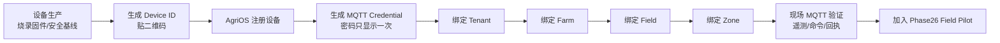

# AgriOS 设备生产、注册与现场接入指南

版本：Phase27  
读者：设备生产人员、现场施工人员、平台管理员。  
目标：每台设备从出厂到 Zone 绑定都有唯一身份、最小 MQTT 权限、可验证遥测和可追溯安装记录。

## 1. 设备注册总流程



设备生产 → Device ID → MQTT Credential → Tenant → Farm → Field → Zone 的次序不得颠倒。气象站等共享设备可以只绑定 Farm/Field；泵、阀和土壤节点必须绑定实际 Zone 或在安装记录中说明跨 Zone 关系。

## 2. Device ID 与标签规范

### 2.1 Device Key

格式：`gdn-{site}-{type}-{zone}-{nn}`，仅使用小写字母、数字和连字符，总长建议 ≤48。

| 设备 | 示例 Device Key |
|---|---|
| Zone A 土壤节点 1 | `gdn-01-soil-a-01` |
| Zone C 阀门控制器 | `gdn-01-valve-c-01` |
| 主泵控制器 | `gdn-01-pump-main-01` |
| 共享气象节点 | `gdn-01-weather-shared-01` |
| Edge Gateway | `gdn-01-edge-main-01` |

Device Key 一经投产不得复用给另一台硬件。更换主板时创建新 Device；旧 Device 标记停用并保留历史数据。

### 2.2 设备标签

标签至少包含：人可读名称、Device Key、硬件序列号、设备类型、额定电压、固件版本、二维码。二维码只编码 Device Key/资产页面地址，禁止包含 MQTT 密码、Wi-Fi 密码或 JWT。

## 3. 出厂安全基线

1. 烧录已签名或校验哈希的发布固件，关闭调试后门和默认口令。
2. 每台设备生成独立硬件序列号；若有安全元件，在安全元件内生成私钥且不可导出。
3. 配置故障安全态：泵 OFF、常闭阀 CLOSED、命令过期拒绝、看门狗开启。
4. 完成 RTC、离线缓存、sequence 持久化、低电量和断网恢复自测。
5. 记录固件哈希、烧录人员、日期、测试台编号和设备序列号。

## 4. 平台对象创建

以下示例均使用 API 前缀 `/api/v1`，请求头必须包含登录 JWT。不要把真实 token 写进脚本仓库。

### 4.1 建立 Tenant、Farm、Field、Zone

管理员在平台完成：

```text
Tenant: Garden Pilot Tenant
└─ Farm: AgriOS Garden 01（timezone=Asia/Shanghai）
   └─ Field: Vegetable Garden（crop=MIXED_VEGETABLE）
      ├─ Zone A
      ├─ Zone B
      ├─ Zone C
      └─ Zone D
```

四个 Zone 的 `code` 分别为 A、B、C、D，并填写面积、边界和目标土壤湿度上下限。施工人员从 API/管理端抄录真实 `tenantId`、`farmId`、`fieldId`、`zoneId`，禁止把名称当数据库 ID。

### 4.2 注册设备

请求：`POST /api/v1/iot/devices`，Header：`Authorization: Bearer <JWT>`、`x-tenant-id: <tenantId>`。

```json
{
  "deviceKey": "gdn-01-soil-a-01",
  "name": "Garden 01 Zone A Soil Node 01",
  "type": "SOIL_SENSOR",
  "farmId": "<farmId>",
  "fieldId": "<fieldId>",
  "zoneId": "<zoneAId>",
  "firmwareVersion": "1.0.0",
  "capabilities": {
    "transport": "LORAWAN_EDGE_MQTT",
    "telemetryIntervalSeconds": 300,
    "sequence": true,
    "offlineBuffer": 10000
  }
}
```

允许的现场主要类型：`SOIL_SENSOR`、`WEATHER_STATION`、`WATER_PUMP`、`VALVE_CONTROLLER`、`GATEWAY`、`GENERIC`。创建泵时同时提交 `maxRuntimeSeconds`；创建阀时提交人可读 `zone`。

成功响应包含：

```json
{
  "device": { "id": "...", "deviceKey": "gdn-01-soil-a-01" },
  "credentials": {
    "username": "<tenantId>:gdn-01-soil-a-01",
    "password": "只显示一次的随机密码"
  },
  "secretShownOnce": true
}
```

将密码直接写入设备安全存储或受控密码库，完成后销毁临时纸条/终端历史。平台数据库只保存哈希，无法恢复明文；丢失时调用 `PATCH /api/v1/iot/devices/{id}/credentials` 轮换，而不是共用另一设备密码。

### 4.3 添加传感器通道

请求：`POST /api/v1/iot/devices/{deviceId}/sensors`。

```json
{ "key": "soil_vwc_15cm", "name": "15 cm Soil Moisture", "type": "SOIL_MOISTURE", "unit": "%VWC" }
```

为每个物理通道建立唯一 key，并记录深度、校准系数和串口地址。通道 key 不随中文名称变化。

## 5. MQTT Topic 规范与兼容性

### 5.1 当前平台可直接使用的 v1（Phase19–27）

这是当前 API、Mosquitto 动态 ACL 和设备模拟器已经实现并通过测试的唯一直接接入主题：

```text
上报 telemetry  agrios/{tenantId}/{deviceKey}/telemetry
控制 commands   agrios/{tenantId}/{deviceKey}/commands
反馈 ack         agrios/{tenantId}/{deviceKey}/ack
```

设备只允许发布自己的 `telemetry` 和 `ack`，只允许订阅自己的 `commands`。QoS 固定为 1；telemetry 不 retained，commands 不 retained，避免设备重连后执行旧命令。

### 5.2 现场语义 v2（Zone 可读主题）

Phase27 施工标识采用以下语义：

```text
agrios/{tenantId}/{zoneCode}/{deviceKey}/telemetry
agrios/{tenantId}/{zoneCode}/{deviceKey}/command
agrios/{tenantId}/{zoneCode}/{deviceKey}/event
```

该 v2 是未来主题规范，当前云 API **不能直接订阅**。Phase27 不修改核心代码，因此只有两种安全用法：

1. 推荐：设备和 Edge 对云仍使用 v1，Zone 从 Device Registry 的 `zoneId` 获取；施工人员可在边缘内部使用 v2 标识。
2. 若现场 LoRa Network Server 输出 v2：Edge Gateway 必须显式映射 `v2 telemetry → v1 telemetry`、`v1 commands → v2 command`、`v2 event → v1 ack`，并保留 correlationId。映射通过验收后才能上线。

禁止让同一设备同时直接发布 v1 和 v2 telemetry，否则会产生重复数据。禁止在未更新云端 ACL 和测试前把设备切换为 v2。

### 5.3 Edge 映射表

| Edge 内部 | AgriOS Cloud | 处理要求 |
|---|---|---|
| `.../{zone}/{device}/telemetry` | `.../{tenant}/{device}/telemetry` | 校验 zone 与 Registry 一致；补 tenant；保持 messageId |
| `.../{tenant}/{device}/commands` | `.../{zone}/{device}/command` | 保持 correlationId、expiresAt、action；过期不转发 |
| `.../{zone}/{device}/event` | `.../{tenant}/{device}/ack` | status 映射为 ACKNOWLEDGED/SUCCEEDED/FAILED |

Edge 映射失败必须进入本地死信日志，不能静默丢弃或猜测 Zone。

## 6. Telemetry 数据契约

```json
{
  "deviceId": "gdn-01-soil-a-01",
  "messageId": "01J...unique...",
  "timestamp": "2026-08-03T08:15:00.000Z",
  "temperature": 24.6,
  "humidity": 67.2,
  "soilMoisture": 31.4,
  "battery": 88,
  "signalStrength": -76,
  "values": {
    "sequence": 1842,
    "firmware": "1.0.0",
    "controllerState": "IDLE",
    "waterVolumeLiters": 0
  }
}
```

约束：

- `deviceId` 必须等于主题中的 Device Key。
- `messageId` 每条唯一，补传不得改变；平台用它去重。
- `timestamp` 为 UTC ISO 8601，设备使用平台/NTP 校时；未来超过 5 分钟的数据会拒绝。
- `sequence` 单调递增并跨重启持久化，用于 Field Pilot MQTT 成功率；回绕必须在固件版本中明确。
- `waterVolumeLiters` 是本采样周期的增量用水量，非累计表底。
- 断网时先写持久缓存，PUBACK 后删除；恢复后限批补传。

## 7. Command 与 Ack 契约

下行示例：

```json
{
  "correlationId": "uuid",
  "action": "IRRIGATION_START",
  "expiresAt": "2026-08-03T08:20:00.000Z",
  "durationSeconds": 600,
  "valveDeviceKey": "gdn-01-valve-a-01",
  "requireValveFeedback": true,
  "safetyTimeoutSeconds": 630
}
```

设备处理顺序：鉴权主题 → 校验 JSON/大小 → 校验 expiresAt → 检查模式/急停/阀反馈/液位 → 返回 ACKNOWLEDGED → 执行 → 返回 SUCCEEDED 或 FAILED。不得仅因收到 MQTT 消息就吸合泵。

回执示例：

```json
{
  "correlationId": "uuid",
  "status": "FAILED",
  "message": "VALVE_NOT_OPEN",
  "executedAt": "2026-08-03T08:16:02.000Z"
}
```

## 8. 现场连接步骤

1. 在平台核对 Device、Tenant/Farm/Field/Zone 绑定。
2. 将唯一 username/password 写入设备；Broker 地址使用域名，不写死 IP。
3. 生产环境使用 MQTT TLS 8883，校验服务器证书和主机名；禁止 `insecureSkipVerify`。
4. 首次只发布一条 telemetry，确认设备详情变为 ONLINE、lastSeen、battery、RSSI 正确。
5. 断开网络 10 分钟产生缓存，恢复后确认 messageId 无重复、sequence 缺口符合预期。
6. 控制器先不接泵动力，订阅 commands 并测试 ACK；通过后才进入电气验收。
7. 运行 `GET /api/v1/iot/events?deviceId=...`，保存 ONLINE、COMMAND_SENT 和执行结果证据。
8. 将设备加入单 Zone Field Pilot，执行 Day1–Day7。

## 9. LoRaWAN 接入约定

- 每个 LoRa 节点使用唯一 DevEUI、JoinEUI、AppKey，优先 OTAA；禁止全场共用 AppKey。
- Edge 保存 `DevEUI → Device Key → Zone` 映射，未知 DevEUI 进入隔离队列，不自动创建云设备。
- LoRa 解码器输出统一 telemetry JSON；原始 payload、FCnt、RSSI、SNR 和 gatewayId 保留在边缘日志。
- 检测 FCnt 回退、重复 Join、长时间无上行；固件更换导致计数器重置必须走维护流程。
- 频段、发射功率、占空比和信道计划必须符合当地法规及实购网关/节点认证。

## 10. Wi-Fi 备用接入

单独维护 SSID/VLAN，只允许访问 Edge MQTT，不直接暴露云数据库/API。使用 WPA2/WPA3、每项目唯一口令、客户端隔离；现场调试结束关闭临时热点。Wi-Fi 节点切换 LoRa/Wi-Fi 时必须保持同一 Device Key、messageId 和 sequence 语义。

## 11. 故障排查

| 现象 | 优先检查 | 禁止做法 |
|---|---|---|
| MQTT 认证失败 | tenantId、Device Key、密码是否轮换、系统时间 | 改用公共账号 |
| 能连接但无数据 | v1/v2 主题、ACL、deviceId 与主题一致性 | 放开 `agrios/#` 写权限 |
| 重复遥测 | messageId、Edge 是否双发 v1/v2、重连缓存 | 删除数据库掩盖问题 |
| Health MQTT=0 | values.sequence 是否存在且持久化 | 手工修改评分 |
| 命令无回执 | 订阅复数 `commands`、correlationId、expiresAt | 取消过期校验 |
| Device ONLINE 但 Zone 无数据 | Registry zoneId、Edge 映射表 | 用名称猜 zoneId |

## 12. 凭据轮换和退役

设备丢失、人员变更、疑似泄漏或维修返厂时立即轮换。轮换后旧密码失效，完成现场重连并记录事件。退役设备先置 DISABLED、关闭 MQTT 客户端和物理电源，再拆除；历史遥测、事件和安装记录保留，不把 Device Key 重新分配。

