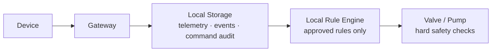
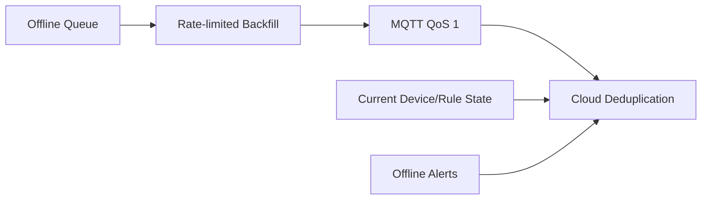

# AgriOS Edge Offline Mode 设计

版本：Phase28
目标：蜂窝/云端不可用时，现场仍安全采集和执行已批准的本地规则；恢复后自动补传、同步状态和上报告警，且不重复执行命令。

## 1. 三种运行路径

### 正常模式


Edge 实时转发遥测，Cloud 负责用户/AI/历史，远程命令经 Edge 校验后执行。

### 断网模式



### 恢复模式



恢复自动执行：数据补传、状态同步、告警上传。历史补传优先级低于实时安全事件和当前状态。

## 2. Edge 状态机

| 状态 | 进入条件 | 行为 | 退出条件 |
|---|---|---|---|
| NORMAL | MQTT TLS 已连接且云探针成功 | 实时上报；队列近零；接受有效云命令 | 连续 3 次探针失败或 MQTT 断开 |
| DEGRADED | 单 SIM/高延迟/高丢包 | QoS 1；压缩非关键数据；准备切链路 | 主链恢复或切备成功；否则 OFFLINE |
| OFFLINE | 双回传不可用 | 写本地；执行本地规则；拒绝依赖云的新决策 | MQTT TLS 会话恢复并通过应用探针 |
| RECOVERING | 网络恢复 | 先状态/告警，后限速补历史；禁并发双发 | 队列清空且状态对账成功 |
| SAFE_MODE | 存储故障、规则损坏、时钟异常、能源临界 | 停止新自动灌溉；保持采集/紧停/关阀 | 现场或受控远程复核后恢复 |

仅 TCP/蜂窝“已连接”不代表 NORMAL；必须完成 DNS、TLS、MQTT CONNACK、订阅和应用层健康探针。

## 3. 本地存储设计

推荐 SQLite WAL（单 Edge）或嵌入式事务数据库，工业 SSD/eMMC。禁止用一个不断追加且不校验的 JSON 文件承担 300 亩生产缓存。

### 3.1 local_telemetry_cache

```sql
CREATE TABLE local_telemetry_cache (
  message_id TEXT PRIMARY KEY,
  tenant_id TEXT NOT NULL,
  gateway_device_key TEXT NOT NULL,
  source_device_key TEXT NOT NULL,
  zone_code TEXT,
  sequence INTEGER,
  recorded_at TEXT NOT NULL,
  received_at TEXT NOT NULL,
  payload_json TEXT NOT NULL,
  priority INTEGER NOT NULL DEFAULT 50,
  attempts INTEGER NOT NULL DEFAULT 0,
  next_attempt_at TEXT,
  cloud_acked_at TEXT
);
CREATE INDEX idx_telemetry_pending
  ON local_telemetry_cache(cloud_acked_at, priority, recorded_at);
```

规则：先本地事务提交，再返回 LoRa 应用确认/进入转发；收到 MQTT PUBACK 不等同云业务已入库，但 AgriOS v1 使用 QoS 1 + `messageId` 数据库去重，重发安全。只有 Agent 确认 publish 完成后设置 `cloud_acked_at`，按保留期异步清理。

### 3.2 offline_queue

统一队列存放：

- P0：SAFETY_STOP、急停、泵阀失败、低液位。
- P1：Gateway 当前状态、ONLINE/OFFLINE、低电量、磁盘告警。
- P2：命令回执、设备事件、规则执行审计。
- P3：实时遥测。
- P4：历史遥测补传、普通日志。

同优先级按 `recorded_at` 先进先出；P0/P1 可抢占，但对 P4 使用令牌桶避免永远饥饿。

### 3.3 容量和保留

- 正常目标：队列 <5 分钟数据。
- 设计：至少 72 小时完整遥测；推荐 30 天低频遥测容量。
- 磁盘 70% WARNING：压缩/清理已确认日志。
- 85% CRITICAL：暂停非关键高频采样，保留安全审计和最新值。
- 95%/写入失败：SAFE_MODE，禁止新自动灌溉；绝不删除未上传安全事件。

数据库每日校验、定期 checkpoint；断电测试验证 WAL 恢复。系统镜像与数据分区隔离。

## 4. Local Rule Engine

### 4.1 可离线执行

- 已由授权用户发布、签名/哈希校验、在有效期内的土壤阈值规则。
- 固定最大运行时间、最小重启间隔、允许灌溉时间窗。
- 阀开到位 → 泵启动 → 流量/压力确认 → 定时停泵 → 关阀的安全序列。
- 缺水、超压、无流量、低电量、急停的立即安全动作。

### 4.2 不可离线自动执行

- 新生成的云 AI 建议、未批准规则、已过期天气预测。
- 需要跨基地配额/用户二次确认的操作。
- 时间不可信、传感器诊断 CRITICAL、阀反馈未知时的启动。
- 超出每日用水量、最大时长或授权 Zone 的动作。

### 4.3 规则包

```json
{
  "ruleSetId": "farm-01-rules-20260803-01",
  "version": 12,
  "validFrom": "2026-08-03T00:00:00Z",
  "validUntil": "2026-08-10T00:00:00Z",
  "zones": ["A", "B"],
  "maxDailyWaterLiters": 20000,
  "maxRuntimeSeconds": 1800,
  "minimumOffSeconds": 120,
  "hash": "sha256:...",
  "approvedBy": "user-id"
}
```

Edge 保留 current 和 last-known-good 两份规则；新包原子写入、验证后切换。验证失败继续旧包并告警，不使用部分更新。

## 5. 命令可靠性和重试

### 5.1 命令记录

每条命令保存 `correlationId`、action、payload hash、issuedAt、expiresAt、source（CLOUD/LOCAL_RULE/MANUAL）、状态和执行结果。`correlationId` 唯一；同一 ID 重复到达只返回已知结果，不再次执行。

### 5.2 重试策略

| 类型 | 最大尝试 | 退避 | 到期行为 |
|---|---:|---|---|
| MQTT 遥测/事件 | 不限定但受保留期 | 2s、5s、15s、30s，之后 1–5min + jitter | 保留并告警容量 |
| 普通阀命令 | 3 | 1s、3s、10s | FAILED，不自动启泵 |
| 泵启动 | 1 个逻辑命令；内部反馈等待 | 不盲重发 | 未确认即安全失败 |
| 泵/阀停止 | 持续到硬反馈或人工接管 | 快速有限重试 + 硬回路 | SAFETY_STOP/派工 |
| 云端命令 | 不跨 expiresAt | 指数退避 | TIMED_OUT，恢复后不执行 |

命令 retry 是对同一 correlationId 的传输重试，不是创建新命令。泵启动超时后绝不自动生成第二个启动 ID。

## 6. 数据补传和避免重复

1. Field Node 产生全局唯一 `messageId` 和持久递增 `sequence`。
2. Edge 不改变原始 messageId；封装中可增加 gatewayReceivedAt、DevEUI、RSSI/SNR。
3. v2 内部主题转换 v1 云主题时只改变 topic，不复制数据记录。
4. MQTT QoS 1 允许重复投递；Cloud 以 `(deviceId, messageId)` 唯一约束去重。
5. 主备 LoRa 网关收到同一 FCnt/payload 时，Network Server 先去重，再进入 Offline Queue。
6. RECOVERING 期间实时流和历史流共用一个写入所有者（single writer），禁止“直发线程 + 补传线程”同时发送同一行。
7. 发布成功后以数据库事务标记 ack；崩溃在 publish 与 mark 之间会重发，但云端去重保证最终一致。

补传限速默认 10–50 条/秒，依据蜂窝质量和云端限流动态调整；不能挤占控制回执。

## 7. 状态同步和冲突处理

恢复后顺序：

1. Gateway ONLINE + 启动原因、软件版本、时钟、电池、磁盘、队列深度。
2. 泵、阀、急停、模式、当前规则版本和所有设备最新状态。
3. P0/P1 告警与安全事件。
4. 命令审计和规则执行结果。
5. 历史遥测。

冲突原则：现场物理反馈 > Edge 已执行状态 > 云端旧缓存。云端在断网期间取消的任务若 Edge 已执行，保留真实执行结果并标记冲突，禁止篡改为“未执行”。恢复时不自动把 Cloud AUTOMATIC 模式覆盖现场 MANUAL/急停锁存。

## 8. 告警上传

离线时所有告警有本地 `eventId`、severity、firstSeen、lastSeen、count、device、evidence。重复告警聚合但不丢首次/末次时间。恢复后先上传 OPEN，再上传 RESOLVED，保证云端知道故障曾发生。

现场可选声光告警/短信 DTU 作为完全断云时的最后通知，但不把个人手机号硬编码进固件。

## 9. MQTT Gateway 层规范

### 9.1 云端保持 v1

```text
agrios/{tenantId}/{deviceKey}/telemetry
agrios/{tenantId}/{deviceKey}/commands
agrios/{tenantId}/{deviceKey}/ack
```

Gateway 自身作为 `EDGE_GATEWAY` Device 使用相同 v1 topic 上报 4G、LoRa 节点数、缓存深度、磁盘、能源和 Edge Mode。

### 9.2 Edge 内部主题

```text
edge/{gatewayDeviceKey}/{zoneCode}/{deviceKey}/telemetry
edge/{gatewayDeviceKey}/{zoneCode}/{deviceKey}/command
edge/{gatewayDeviceKey}/{zoneCode}/{deviceKey}/event
```

Edge Agent 是内部↔云唯一桥接写入者：验证 Device Registry 后把内部 telemetry 映射到云 v1；云 commands 映射内部 command；内部 event 转云 ack。云端不订阅内部 topic，Field Node 不持有全租户云凭据。

## 10. 安全与运维

- 本地数据库磁盘加密；凭据进入 TPM/安全元件或 root-only secret store。
- Edge UI 默认关闭公网访问，通过 VPN/MFA；所有配置变更审计。
- NTP 不可用时由 RTC 保持；偏差超阈值进入 DEGRADED/SAFE_MODE。
- 升级使用 A/B 或容器 last-known-good 回滚；升级期间不执行新自动任务。
- 每月做断网恢复，每季做 72 小时缓存演练，每半年做断电/WAL 恢复。

## 11. 验收指标

- 72 小时断网不丢遥测/安全事件，恢复后业务重复数为 0。
- 本地规则在云断开时按安全条件执行，未批准/过期规则执行数为 0。
- 网络恢复后 P0/P1 ≤2 分钟可见，全部历史按容量目标补完。
- 所有命令 correlationId 可追溯，泵重复启动数为 0。
- 磁盘满、时间异常、规则损坏均进入 SAFE_MODE。
