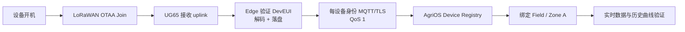

# AgriOS 第一台真实设备接入流程

> 示例：`gdn-01-soil-a-01` / Dragino LSE01-CN470-8 / Zone A。其他 LoRa 传感器复用流程，控制器另需安全联锁验收。

## 1. 端到端路径



## 2. 开机前

| 项目 | 值 |
|---|---|
| Asset/Serial | __________ |
| Device Key | `gdn-01-soil-a-01` |
| DevEUI | __________ |
| JoinEUI/AppEUI | __________ |
| AppKey secret reference | `secret://__________` |
| Tenant/Farm/Field/Zone IDs | __________ / __________ / __________ / __________ |
| Firmware | __________ |
| Sampling/report interval | __________ / __________ min |

- [ ] 设备通过采购验收，确认为 CN470，电池/电源正常。
- [ ] Device Key 尚未使用；DevEUI 在 UG65、Edge 和 AgriOS 全局唯一。
- [ ] AppKey 由两人复核导入密钥库，未出现在聊天、照片或 Git。
- [ ] AgriOS 已创建 SOIL_SENSOR 并绑定目标 Field/Zone，取得每设备 MQTT secret reference。
- [ ] UG65 与节点 CN470 通道计划一致；Gateway、Edge、Cloud 均健康。

## 3. 设备开机与 LoRa Join

1. 在距 UG65 3–5 m、天线正确连接的台架位置开机/激活设备。
2. 在 UG65 查看 Join Request：核对 DevEUI/JoinEUI，不以列表顺序猜设备。
3. Join Accept 后记录时间、频点、data rate、RSSI、SNR 和 frame counter。
4. 若 5 min 未 Join，只检查频段/通道、AppKey、DevEUI、天线和电池；不得反复恢复出厂导致密钥/计数器混乱。
5. 连续重入网 3 次均成功后固定配置，保存不含 AppKey 的截图。

Join 通过：3/3 成功；无未知 DevEUI；同一 DevEUI 没有同时绑定另一设备。

## 4. Gateway 接收与 Edge 处理

1. 等待第一条 uplink，保存原始 payload、receivedAt、RSSI、SNR、channel、gateway ID。
2. Edge 以 DevEUI 查映射；必须唯一匹配 `gdn-01-soil-a-01`。
3. Payload decoder 输出：soilMoisture、temperature、EC、battery、sequence；保留 raw payload hash。
4. 校验 timestamp、单位和物理范围。失败帧进入 quarantine 并报警，不上传伪造默认值。
5. 生成稳定 `messageId`，先写 local telemetry/offline queue，再尝试 Cloud。

样例验证记录：

```json
{
  "deviceId": "gdn-01-soil-a-01",
  "messageId": "<uuid>",
  "timestamp": "<device-or-gateway-utc-time>",
  "temperature": 22.4,
  "battery": 95,
  "signalStrength": -91,
  "values": {
    "soilMoisture": 31.2,
    "ec": 0.42,
    "loraRssi": -91,
    "loraSnr": 7.5,
    "frameCounter": 1
  }
}
```

字段名以当前 AgriOS v1 contract 和 decoder 测试为准；不要在现场临时改变单位。

## 5. MQTT 上传

1. Edge 使用该设备自己的 MQTT credential 建立 TLS 连接，校验 Broker CA 和主机名。
2. QoS1 publish 到 `agrios/{tenant}/gdn-01-soil-a-01/telemetry`。
3. 收到 PUBACK 后标记 queue item 已交付；未收到则保留同一 messageId 重试。
4. 验证 Gateway credential 不能发布本设备主题，本设备 credential 不能发布其他设备主题。
5. 在 Broker/API 审计中记录 clientId、topic、messageId 和接收时间，不记录密码。

## 6. AgriOS Zone 绑定与可见性

1. 打开设备详情，核对类型 SOIL_SENSOR、Field、Zone A 和硬件序列号。
2. 等待 latest telemetry，确认 ONLINE、lastSeenAt、battery、RSSI、土壤水分/温度/EC。
3. 在历史曲线确认至少 5 个连续采样点，时间排序正确，无重复 messageId。
4. 与现场读数/校准记录比较；未完成土壤标定时标记 `UNCALIBRATED`，不得用于自动灌溉阈值。
5. 在移动端确认同一 Zone 可见；其他租户和 Zone 无权访问。

## 7. 断网补传与失败处理

1. 关闭 UR35 蜂窝 30 min，至少产生 3 条 uplink。
2. 确认 UG65 接收、Edge 缓存增长、Cloud latest 不错误刷新。
3. 恢复网络，检查全部缓存补传、采集时间保留、重复为 0。

| 失败点 | 判定 | 处理 |
|---|---|---|
| 无 Join Request | 设备未发射/频段或电源问题 | 检查电源、CN470、天线、激活方式 |
| Join Request 有但拒绝 | 身份/AppKey/通道不匹配 | 双人复核，不创建重复身份 |
| UG65 有 uplink、Edge 无 | 内部转发/网络/Topic 问题 | 检查 LAN 与 UG65→Edge 单一路径 |
| Edge quarantine | DevEUI 映射或 decoder 失败 | 修正映射/decoder，禁止借用身份 |
| MQTT 拒绝 | CA、时钟、凭据、ACL | 校时并轮换/修复，不降级明文 |
| Cloud 有数据但 Zone 错 | Registry 绑定错误 | 暂停转发，修正绑定并审计 |

## 8. 上线签字

| Gate | 结果 | 证据 |
|---|---|---|
| 采购验收 | [ ]PASS | |
| OTAA 3/3 | [ ]PASS | |
| 5 条有效遥测 | [ ]PASS | |
| MQTT ACL 负向测试 | [ ]PASS | |
| Zone/租户隔离 | [ ]PASS | |
| 30 min 离线补传 | [ ]PASS | |
| 校准状态明确 | [ ]PASS | |

设备状态：[ ]PROVISIONED [ ]QUARANTINED [ ]REJECTED

安装人：__________  AgriOS 复核：__________  农场负责人：__________  日期：__________
