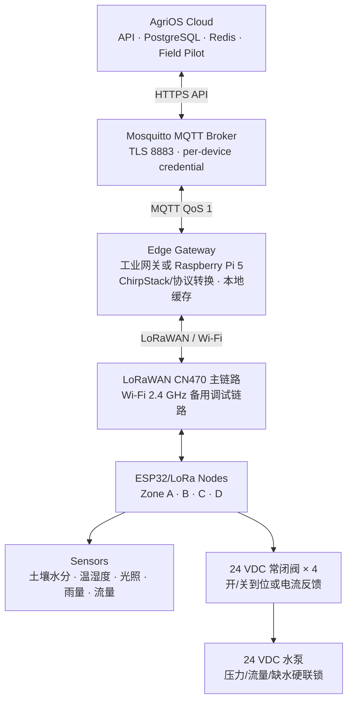

# AgriOS 小菜园现场施工图与总体部署设计

版本：Phase27 / G1 参考施工版  
用途：未来 300 亩基地的 1:1 功能缩小验证，不按面积等比例缩减安全标准。  
设计基准：20 m（东西）× 12 m（南北）、总面积约 240 m²、4 个独立灌溉 Zone。现场尺寸不同时，保持设备拓扑和安全间距，施工负责人在开工前完成红线图并签字。

## 1. 系统总体架构图



数据上行：传感器 → Node → LoRaWAN 网关 → Edge Gateway → MQTT → AgriOS。  
控制下行：AgriOS → MQTT → Edge Gateway → Node → 阀门/水泵。  
安全链路：液位、压力、过流、硬急停直接作用于泵控制回路，不能经过云端或无线网络。

## 2. 平面施工定位图

坐标原点 `(0,0)` 为菜园西南角，X 向东、Y 向北。尺寸单位为米。

```text
北 y=12 m
       0          5          10         15         20 m
       ┌──────────┬──────────┬──────────┬──────────┐
       │ Zone A   │ Zone B   │ Zone C   │ Zone D   │
       │ S-A2 ●   │ S-B2 ●   │ S-C2 ●   │ S-D2 ●   │ y=9
       │          │          │          │          │
GW ●───│ S-A1 ●   │ S-B1 ●   │ S-C1 ●   │ S-D1 ●   │ y=5.5
(1,13) │          │          │          │          │
       │ V-A ◇    │ V-B ◇    │ V-C ◇    │ V-D ◇    │ y=1
       └────┬─────┴────┬─────┴────┬─────┴────┬─────┘
            └──────────┴──────┬───┴──────────┘  25 mm 支管
                              │ 32 mm 主管
水箱 TK (−3,1) ─ 过滤器 ─ 流量计 FM ─ 泵 P ─ 止回阀 ─ 压力表
控制箱 CP (−1,2)       太阳能阵列 PV (2,−3)，朝南、无遮挡
南 y=0 m
```

若 GW 无法安装在北侧围墙外 1 m，可移至菜园中心立杆，高度仍须高于作物和周边障碍物至少 2 m。PV 与泵房不得占用排水沟或人员疏散路线。

## 3. Zone 划分

| Zone | 范围 | 建议作物/用途 | 传感器 | 执行器 | 状态监测 |
|---|---|---|---|---|---|
| A | x=0–5, y=0–12 | 基准灌溉组 | S-A1、S-A2 土壤水分；共享空气温湿度 | V-A | 电量、RSSI、阀电流/到位 |
| B | x=5–10, y=0–12 | 对照组 | S-B1、S-B2；共享光照 | V-B | 同上 |
| C | x=10–15, y=0–12 | 自动策略组 | S-C1、S-C2；共享空气温湿度 | V-C | 同上 |
| D | x=15–20, y=0–12 | 弱网/恢复组 | S-D1、S-D2；共享雨量 | V-D | 同上 |

每 Zone 两个采样点：`S-x1` 位于低/中地势代表点，`S-x2` 位于高地势或距供水端更远的位置。共享气象节点安装在菜园中央或北侧开阔点，其 Device 绑定 Farm/Field，不绑定单一 Zone，避免一个气象站被错误计入四次。

## 4. 设备安装位置与方法

### 4.1 土壤传感器

- 横向距田埂 ≥0.5 m，距滴头/出水孔 0.25–0.40 m，避开排水低点、石块和施肥集中区。
- 每点安装 15 cm 主探头；预算允许时 Zone A、C 增设 30 cm 深层探头。
- 探针水平插入原状土，四周回填同质细土并压实，不留空气隙；线缆向下形成滴水弯。
- 地面接线盒使用 IP67，离地 0.4–0.8 m；传感器线与阀门/水泵动力线平行间距 ≥0.3 m，交叉时成 90°。

### 4.2 控制箱 CP

- 位于水源和四区主管入口附近，但距水箱溢流口、喷头和积水边缘 ≥1.5 m；箱底离地 ≥0.6 m。
- 面板朝北或东，避免正午暴晒；前方保留 0.8 m 检修空间。
- 箱内强电区、24 V 执行区和 5/3.3 V 弱电区用隔板/线槽分开。外壳设置 PE 接地点和不可移除的回路标签。

### 4.3 水泵、阀门和管路

- 泵安装在混凝土基座，设置防雨棚但保持散热；泵入口采用粗过滤器，出口依次安装止回阀、压力表、流量计和总截止阀。
- 四个 24 VDC 常闭阀安装在分水歧管，箭头与水流一致；每个阀前后留活接，阀盒底部铺 100 mm 碎石排水。
- 主管建议 PE32，Zone 支管 PE25；实际管径须按泵曲线、最大同时流量和压损重新核算。灰度期间只允许单 Zone 运行。
- 水泵和阀门都贴永久标签：`P-01`、`V-A` 至 `V-D`，与 AgriOS Device Key 一致或在安装记录中建立唯一映射。

### 4.4 太阳能阵列

- 位于菜园南侧无遮挡区域，距植被和喷淋边界 ≥1 m，最低边离地 ≥0.8 m。
- 朝正南；倾角暂按当地纬度，冬季连续阴雨校核后调整。结构需满足当地最大风荷载。
- 光伏电缆穿耐候波纹管，正负极均有清晰永久标识；线缆入箱前形成滴水弯。

### 4.5 网关 GW

- 安装高度 3–5 m，天线高于附近障碍物至少 2 m；与大面积金属、水箱保持 ≥1 m。
- 天线、避雷器、馈线均为 50 Ω，馈线尽量短；网关和天线杆接入独立防雷/等电位系统。
- 主回传为有线宽带或 4G/5G，双 SIM/第二运营商作为备份；施工调试 Wi-Fi 不作为无人值守主链路。

## 5. 设备编号与线缆表

| 编号 | 设备 | 位置 | 电源 | 通信 | 建议线缆 |
|---|---|---|---|---|---|
| GW-01 | Edge/LoRaWAN 网关 | (1,13)，高 3–5 m | 12/24 VDC 或 PoE | 以太网/4G + LoRaWAN | 室外 Cat6、50 Ω 馈线 |
| CP-01 | 主控制箱 | (−1,2) | 24 VDC 母线 | Wi-Fi/LoRa/MQTT | 分区线槽 |
| P-01 | 水泵 | (−2,1) | 24 VDC 独立回路 | 硬接线至 CP | 2×4 mm²，按实测电流复核 |
| V-A…V-D | 常闭电磁阀 | 各区南端 | 24 VDC | 节点数字输出 | 2×1.0 mm² |
| S-A1…S-D2 | 土壤探头 | 平面图坐标 | 5–12 VDC | RS485/模拟量至节点 | 屏蔽双绞线 2×2×0.5 mm² |
| WS-01 | 温湿度/光照/雨量 | 中央开阔处 | 12 VDC/电池 | LoRaWAN | 厂商原装线 |
| FM-01 | 流量计 | 泵出口直管段 | 12–24 VDC | 脉冲/RS485 | 屏蔽双绞线 |

最终线径必须由持证电工根据实际长度、启动电流、允许压降（控制回路建议 ≤5%）和敷设方式确认。本表不能替代当地电气规范计算。

## 6. 施工顺序与停工点

1. 放线测量并提交红线图；未确认水源、电源、排水和地下管线不得开挖。
2. 安装泵、过滤器、流量计、主管和阀组，进行 1.5 倍工作压力或管材允许值范围内的水压试验。
3. 安装控制箱、光伏和保护器件；持证电工完成绝缘、极性、接地和短路保护测试。
4. 安装网关并完成 RF 勘测；每个节点至少在两个位置测试后再固定。
5. 埋设传感器、建立设备档案和照片记录。
6. 断开泵动力回路，先验证遥测、阀门低风险动作和急停逻辑。
7. Hardware Acceptance Checklist 全部通过后，才允许泵带水测试。

必须停工：地下管线不明、保护接地不合格、箱体进水、阀门方向不明、泵空转、无线链路无余量、设备 ID 与图纸不一致。

## 7. 施工交付物

- 红线平面图、管路图、电气单线图和端子排表。
- 设备序列号、Device ID、固件版本、安装坐标和照片。
- 传感器校准、绝缘/接地、泵阀、流量和急停测试记录。
- MQTT 接入记录、Day0–Day7 Field Pilot 报告、异常工单和最终签字表。

