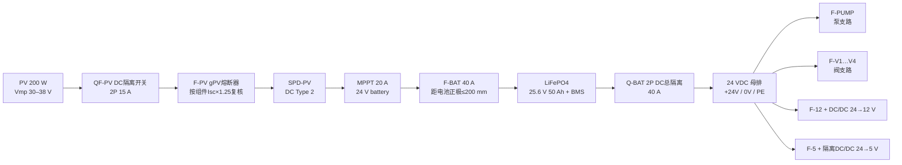
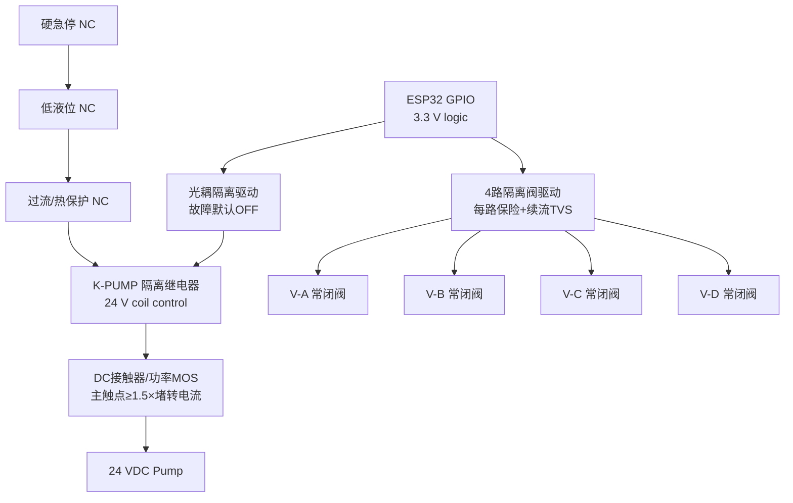

# AgriOS 小菜园电气接线设计

版本：Phase27 / ED-G1  
系统基准：24 VDC 光伏储能，ESP32/LoRa 控制，4 个 24 VDC 常闭阀，1 台 24 VDC 水泵。最终施工图必须由持证电工按实购铭牌、线路长度和当地规范复核。

## 1. 设计边界与安全原则

- ESP32 只能输出逻辑信号，禁止直接带阀线圈、水泵或接触器大电流。
- “ESP32 → 继电器 → 水泵”中的继电器是隔离控制级；泵主回路必须使用额定 DC 接触器或 MOSFET 功率驱动和独立保护。
- 硬急停、低液位、过流/热保护串联在泵接触器线圈回路，云端、网关、ESP32 故障时仍能断泵。
- 阀门选 24 VDC 常闭型；控制失电时自动关闭。泵的默认安全态为断电停止。
- 24 V 动力、12/5/3.3 V 弱电和任何交流输入物理分区。若引入 220 VAC，必须另出交流施工图。

## 2. 太阳能供电单线图

接线顺序：太阳能板 → MPPT → LiFePO4 电池 → DC 总保护 → 24 V 母排 → 各控制模块。禁止先接 PV 后不接电池，具体上电/断电顺序服从 MPPT 厂商说明。

### 2.1 电压和电流预算

| 负载 | 额定电压 | 设计电流示例 | 保护建议 |
|---|---:|---:|---|
| 水泵 P-01 | 24 VDC | 额定 15 A，启动/堵转以铭牌为准 | 25–30 A DC 分断器/保险，最终按泵曲线复核 |
| 电磁阀 V-A…D | 24 VDC | 每路 0.25–0.6 A | 每路 1 A 慢断保险 |
| 网关/路由器 | 12 VDC | 合计 2 A | 12 V 输出侧 3 A |
| Edge/Pi 5 | 5 VDC | Pi 5 设计 5 A | 5 V 输出侧 6 A，线长尽量短 |
| ESP32/传感器 | 5/12 VDC | 每节点 <0.5 A | 每节点 1 A |

保险的任务是保护线缆，不是保护软件。额定值须同时满足正常启动不误断、短路时可靠分断、线缆允许载流量大于保护额定值。DC 设备必须有明确直流分断能力，不能用只标 AC 的断路器代替。

## 3. 泵和阀门控制原理图

安全启动顺序：打开目标阀 → 等待开到位/电流反馈 → 确认液位、压力初态 → 启动泵 → 在规定时间内确认流量。停机顺序：停泵 → 确认流量下降 → 关闭阀。任何一步超时进入硬件安全态并上报事件。

## 4. 端子排定义

### 4.1 主电源端子 X1

| 端子 | 名称 | 线色建议 | 连接 |
|---|---|---|---|
| X1-01 | PV+ | 红 | PV 隔离开关输入 |
| X1-02 | PV− | 黑 | PV 隔离开关输入 |
| X1-03 | BAT+ | 红 | 电池主保险后 |
| X1-04 | BAT− | 黑 | 电池负极 |
| X1-05 | +24V BUS | 红 | 直流母排 |
| X1-06 | 0V BUS | 蓝/黑 | 直流母排 |
| X1-PE | PE | 黄绿 | 箱体/浪涌/结构地 |

### 4.2 执行器端子 X2

| 端子 | 信号 | 端子 | 信号 |
|---|---|---|---|
| X2-01/02 | PUMP+/PUMP− | X2-11/12 | V-A+/V-A− |
| X2-03/04 | Flow pulse+/− | X2-13/14 | V-B+/V-B− |
| X2-05/06 | Pressure 4–20mA+/− | X2-15/16 | V-C+/V-C− |
| X2-07/08 | Low-level NC | X2-17/18 | V-D+/V-D− |
| X2-09/10 | E-stop NC | X2-19/20 | Valve feedback common/DI |

每根线两端使用相同热缩号码管；备用端子不少于 20%。屏蔽层只在控制箱端接 PE，除非传感器厂家明确要求另一种方式，避免地环路。

## 5. ESP32 I/O 参考分配

| I/O | 功能 | 电气接口 | 上电默认 |
|---|---|---|---|
| GPIO16/17 | RS485 UART | 隔离 RS485 收发器 | 接收 |
| GPIO25 | 泵允许 | 光耦 DO | LOW/OFF |
| GPIO26–29 | 阀 A–D | 光耦 DO | LOW/CLOSED |
| GPIO32 | 急停状态 | 24 V 隔离 DI，NC | 断线视为急停 |
| GPIO33 | 低液位 | 24 V 隔离 DI，NC | 断线视为缺水 |
| GPIO34 | 流量脉冲 | 隔离高速 DI | 无流量 |
| ADC1 | 压力 4–20 mA | 隔离采集/精密电阻 | 越界故障 |

具体 GPIO 必须避开 ESP32 启动绑带脚和所用模块保留脚；不得直接把 24 V、4–20 mA 或长线信号接入 MCU 引脚。

## 6. 保护设计

### 6.1 防反接

- PV 使用防呆 MC4 和极性测试；电池入口采用防反 MOS/理想二极管模块或 DC 接触器极性联锁。
- 首次上电前用万用表确认 PV、BAT、24 V、12 V、5 V 极性并记录。
- 保险安装在能量源正极附近；电池主保险距正极端子建议 ≤200 mm。

### 6.2 浪涌与感性负载

- PV 输入和室外长线设置合适的 DC SPD；LoRa 馈线入口装同频段气体放电避雷器。
- DC 阀线圈使用续流二极管或 TVS。普通二极管释放慢，若关阀时间有要求，选 TVS/齐纳方案并按驱动器额定值校核。
- 水泵两端按厂家建议配置 TVS/吸收网络；信号口使用隔离和浪涌保护。

### 6.3 低压与过流

- BMS 是电池最后保护，不作为日常负载开关。MPPT/控制器应在 BMS 硬切断前进入低压降级。
- 20% 电量进入节能；10% 禁止新的非安全动作；紧停、阀关闭和告警通道保留能源预算。
- 每一路阀、泵、DC/DC 独立保险，避免一个短路拖垮全部现场设备。

## 7. 强弱电隔离与布线

- 箱内左侧为光伏/电池/泵动力，右侧为控制和通信；用独立线槽，间距 ≥100 mm 或金属隔板分隔。
- 室外泵动力线与传感器/RS485 平行间距 ≥300 mm；无法满足时分别穿金属管并单点接地。
- 动力与信号交叉必须 90°。RS485 采用总线，不允许星形长支路；总线两端 120 Ω，分支尽量 <0.3 m。
- 0 V 与 PE 不得随意多点相连；等电位方案由电气负责人统一确定。

## 8. 防水和箱体

- 主箱最低 IP65，节点箱 IP67；格兰头必须与实际线径匹配，闲置孔用同等级堵头。
- 进线从箱底进入并做滴水弯；箱内设置防凝露透气阀，不用开孔“散热”。
- PCB、端子和电池不得位于箱底积水面；底部保留排水风险观察空间。
- 阀盒允许排水但电气接头必须 IP68。施工完成执行 10 分钟人工淋雨检查，内部不得出现水滴。

## 9. 上电与调试步骤

1. 所有负载断开，完成绝缘、连续性、接地、极性和紧固扭矩检查。
2. 接电池并确认 MPPT 参数为 LiFePO4；再接 PV。测量 24 V 母线。
3. 逐一接通 DC/DC，确认 12 V 和 5 V，观察 15 分钟温升。
4. ESP32 上电但泵主保险保持断开，验证所有输出默认 OFF。
5. 逐阀动作并测电流；验证断电常闭。
6. 模拟急停、低液位、过流，确认接触器线圈物理失电。
7. 接泵主保险，先点动确认水路和方向，再带水运行；禁止空转。

## 10. 电气验收记录

必须记录：PV Voc/Isc、充电电流、电池开路/负载电压、各 DC/DC 输出、泵启动/额定电流、阀线圈电流、保护器件型号、线径、接地测试、急停响应时间和箱体淋雨结果。任何数据缺失均不得进入 Field Pilot Day3 自动灌溉。

