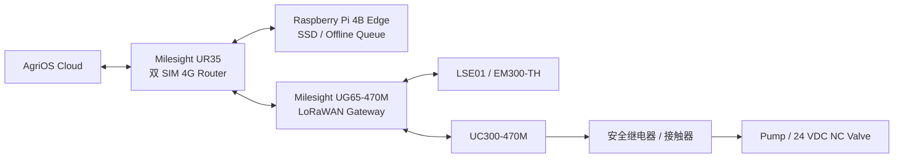

# AgriOS 第一次真实部署最终采购清单

> Phase29 冻结版：2026-08-03

## 1. 采购结论与适用边界

本清单用于 **4 Zone 小菜园/单 Zone 首次灰度**，验证 Phase27–28 的设备接入、断网自治、自动灌溉和太阳能运行。300 亩全面铺开前必须根据本次 RF、能耗和水力数据重新扩容。

采购架构冻结为：

UG65、UR35 和 Edge 合称 `GW-01 Gateway Station`。不使用 Wi-Fi 作为生产回传，不让 LoRa 控制器输出直接承载水泵电流。

## 2. 冻结 BOM

价格仅用于预算，含税、运费、安装和无线电合规费用以正式报价为准。下单必须写完整频段/电压后缀，不接受供应商擅自替换。

### 2.1 Gateway Station

| ID | 冻结型号 | 数量 | 下单配置 | 用途 | 预算 |
|---|---|---:|---|---|---:|
| G01 | Milesight UG65 Cellular/Global hardware，`470M` | 1 | CN470、SX1302 8 通道、外置 N-Female LoRa 天线、9–24 VDC/PoE、IP65；4G 不作为必需回传 | LoRaWAN Network Server/Packet Forwarder | ¥4,000–6,500 |
| G02 | Milesight UR35，中国 LTE 版本 | 1 | 双 SIM、双以太网、9–48 VDC、DIN 安装；确认移动/联通频段和中国型号核准 | 4G 主/备运营商回传 | ¥1,800–3,500 |
| G03 | Raspberry Pi 4 Model B 4 GB | 1 | 官方 4 GB 主板、DIN 导轨金属壳、工业级 5 V/5 A DC/DC、硬件 RTC | Phase28 Edge Agent | ¥700–1,100 |
| G04 | Samsung T7 Shield 500 GB SSD | 1 | USB 3、禁用 microSD 作为业务数据盘 | SQLite cache、日志、镜像备份 | ¥500–750 |
| G05 | 470–510 MHz 玻璃钢天线套件 | 1 | 3–5 dBi、50 Ω、N 型、馈线 ≤3 m、同轴避雷器 | LoRa 覆盖 | ¥500–1,000 |
| G06 | 工业 SIM | 2 | 中国移动 + 中国联通各一张；每月 ≥5 GB，允许 MQTT/TLS、NTP、VPN | 双运营商 | ¥600–2,000/年 |

采购 G01 时以厂家订单确认书写明 `CN470/470M`。Milesight 命名和后缀可能随区域/蜂窝模组变化，不凭网页简称猜完整 SKU。

### 2.2 LoRa 节点与传感器

| ID | 冻结型号 | 数量 | 配置 | 安装位置 | 预算 |
|---|---|---:|---|---|---:|
| N01 | Dragino LSE01-CN470-8 | 4 | CN470、8500 mAh、LoRaWAN OTAA；土壤水分/温度/EC | Zone A–D 各 1 | ¥4,000–6,000 |
| N02 | Milesight EM300-TH-470M | 1 | CN470、IP67、NFC；空气温湿度 | 百叶防辐射罩内 | ¥700–1,100 |
| N03 | Milesight UC300-470M | 1 | LoRaWAN CN470、4DI/2DO、RS485；24 VDC | 泵房控制箱 | ¥1,500–2,500 |
| N04 | LSE01-CN470-8 | 1 | 与 N01 完全同批次 | 冷备件/校准对照 | ¥1,000–1,500 |

首次部署不采购来源不明的裸 SX1262 开发板作为生产节点。ESP32 + SX1262 仅保留为研发备选；真实现场先使用具备外壳、唯一 OTAA 密钥、可换电池和厂商协议文档的整机。

### 2.3 水与环境传感器

| ID | 冻结规格/型号 | 数量 | 接口 | 验收要求 | 预算 |
|---|---|---:|---|---|---:|
| S01 | Dragino LSE01-CN470-8（同 N01） | 4+1 | LoRaWAN | 与烘干法/便携标准仪做当地土壤两点标定 | 已计 |
| S02 | Milesight EM300-TH-470M | 1 | LoRaWAN | 与校准温湿度计同箱对比 2 h | 已计 |
| S03 | GF Signet 2536 Rotor-X DN25 + 3-2536-P0 | 1 | 开集电极脉冲 | K-factor 证书、流向和直管段符合说明书 | ¥2,000–3,500 |
| S04 | 顶盛科技 JDZ05 翻斗雨量计 | 1 | 0.2 mm/脉冲 | 带水平泡；500 mL 定量滴水复核 | ¥500–900 |
| S05 | 建大仁科 RS-GZ-N01-2-5 | 1 | RS485 Modbus、0–200 klux | 户外防护罩；与手持照度计趋势比对 | ¥500–900 |
| S06 | 24 VDC 投入式液位变送器 | 1 | 4–20 mA，0–5 m，IP68 | 量程按水箱高度；空/满点校验 | ¥600–1,200 |

S03–S06 在 UC300 接口不足时接入 LOGO!/隔离采集模块，不得并线硬接。采购前要求供应商提供寄存器表、接线图和校准证书；缺少任一项则拒收。

### 2.4 太阳能与配电

| ID | 冻结型号 | 数量 | 配置 | 预算 |
|---|---|---:|---|---:|
| P01 | LONGi LR5-54HTH-440M | 1 | 440 W 单晶组件；以实际铭牌 Voc/Isc 复核 MPPT | ¥700–1,100 |
| P02 | Victron SmartSolar MPPT 100/20 | 1 | 100 V PV、20 A、24 V 电池、VE.Direct/Bluetooth | ¥1,200–1,800 |
| P03 | Victron Lithium Battery Smart 25.6 V/100 Ah | 1 | 2.56 kWh LiFePO4 | ¥10,000–15,000 |
| P04 | Victron VE.Bus BMS V2 | 1 | 与 P03 配套；控制充/放电许可 | ¥2,000–3,000 |
| P05 | Victron SmartShunt 500 A | 1 | SOC、累计 Ah、历史最低电压 | ¥800–1,200 |
| P06 | Phoenix Contact QUINT4-DC/DC 24DC/5DC/10/PT | 1 | 隔离 24→5 V，给 Edge 供电 | ¥1,500–2,500 |
| P07 | PV/DC 保护套件 | 1 | 2P DC 隔离开关、gPV 熔断、DC SPD、防反接、电池 40 A 主熔断和支路保险 | ¥1,500–2,500 |
| P08 | IP65 户外控制箱 | 1 | 强弱电隔板、DIN 导轨、温控风扇/防凝露、门禁开关 | ¥1,500–3,000 |

440 W 组件在 24 V 系统下处于 SmartSolar 100/20 的功率范围内，但必须用项目最低设计温度修正后的 Voc <100 V，且 Isc 不超过控制器限制。Victron MPPT 不是户外裸装器件，必须安装在防水、通风控制箱内。

### 2.5 控制与灌溉

| ID | 冻结型号 | 数量 | 配置/用途 | 预算 |
|---|---|---:|---|---:|
| C01 | Siemens LOGO! 8.4 12/24RCE | 1 | 泵阀本地安全状态机、硬接线 DI、以太网维护 | ¥1,500–2,500 |
| C02 | Phoenix Contact PLC-RSC-24DC/21 | 6 | 24 VDC 接口继电器；UC300/LOGO 与执行回路隔离 | ¥600–1,000 |
| C03 | Schneider TeSys D LC1D 系列接触器 | 1 | 线圈 24 VDC；主触点按泵铭牌和启动电流选具体电流档 | ¥300–700 |
| C04 | Schneider LRD 热过载继电器 | 1 | 与 C03 配套；整定按泵铭牌 | ¥250–500 |
| C05 | Bürkert 6213 EV，DN25，24 VDC，NBR | 4 | 常闭；压力范围须覆盖现场，Zone A–D | ¥6,000–10,000 |
| C06 | Schneider Harmony XB5AS8442 | 1 | 红色蘑菇头、旋转释放、2NC 急停 | ¥180–350 |
| C07 | Schneider Harmony XB5AD33 | 1 | 手动/停止/自动三位保持选择开关 | ¥120–250 |
| C08 | 24 VDC 声光报警器 | 1 | IP65，独立熔断 | ¥150–300 |

水泵型号不在未完成水力勘测时盲目冻结。采购订单中的 `PUMP-01` 必须在下列输入全部签字后，从厂家泵曲线锁定：设计流量、总扬程、吸程、水质、管径压损、每日运行时长、24 VDC 或 AC 母线。首测可使用现场已有泵，但须经 C03/C04、缺水保护、急停和超时保护控制。**没有泵曲线匹配记录不得下单，也不得自动运行。**

## 3. 采购预算

| 分组 | 预算小计 |
|---|---:|
| Gateway Station | ¥8,100–14,850 |
| LoRa 节点 | ¥7,200–11,100 |
| 补充传感器 | ¥3,600–6,500 |
| 太阳能/配电 | ¥19,200–30,100 |
| 控制设备（不含泵） | ¥9,100–15,100 |
| 安装辅材、管路、防雷、人工预留 | ¥8,000–15,000 |
| **首套总预算** | **¥55,200–92,650 + 水泵** |

## 4. 下单与到货闸门

### 下单前

- [ ] UG65、EM300-TH、UC300 和 LSE01 的订单均写明 CN470/470M。
- [ ] 无线设备具有中国使用所需的型号核准/合规资料。
- [ ] 双 SIM 现场手机测速已证明至少两个运营商之一可用。
- [ ] PV 最低温 Voc、Isc 和 MPPT 计算完成。
- [ ] 阀门介质、压力、压差、流向和线圈电压确认。
- [ ] 泵的水力计算与泵曲线交点已签字，否则不采购泵。

### 到货拒收条件

- 频段为 EU868/US915、设备密钥重复、包装/铭牌型号与订单不符。
- 电池缺少 BMS 配套要求、运输/安全资料或序列号。
- 传感器无协议/寄存器表，控制器无接线图，设备外壳破损进水。
- 供应商以“兼容型号”替代冻结型号但未通过书面变更评审。

## 5. 官方规格基线

- [Milesight UG65](https://www.milesight.com/iot/product/lorawan-gateway/ug65)
- [Milesight UC300](https://www.milesight.com/iot/product/iot-controller/uc300)
- [Milesight EM300-TH 产品资料](https://resource.milesight.com/milesight/iot/document/em300-th-user-guide-en.pdf)
- [Dragino LSE01](https://www.dragino.com/products/agriculture-weather-station/item/159-lse01.html)
- [Victron SmartSolar MPPT 100/20](https://www.victronenergy.com/solar-charge-controllers/smartsolar-mppt-75-10-75-15-100-15-100-20)
