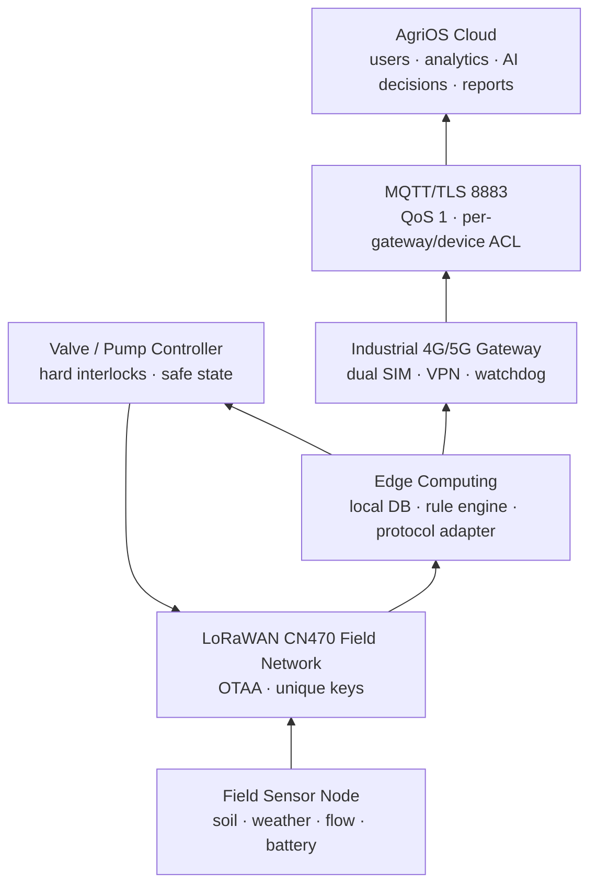
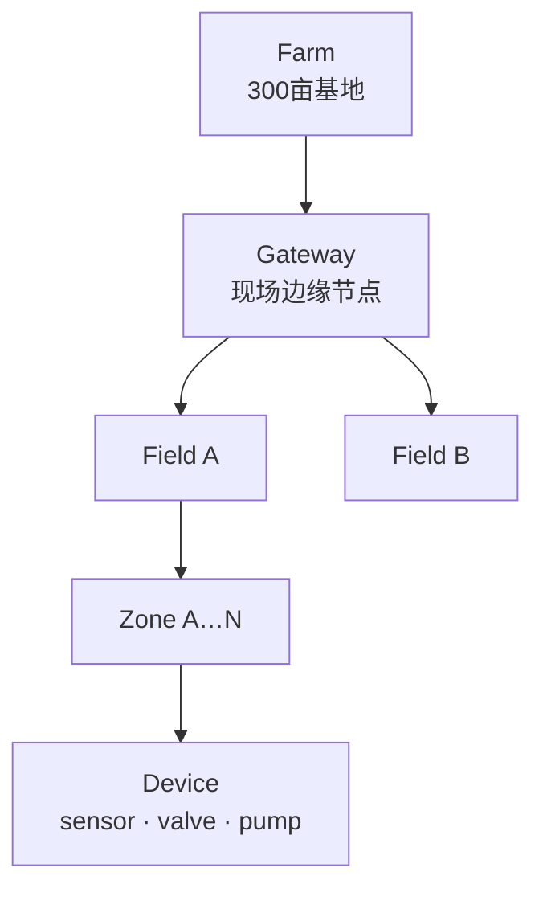

# AgriOS 野外无固定网络通信架构设计

版本：Phase28 / 300 亩远程基地参考设计
场景：无光纤、无 Wi-Fi、无机房、无人值守、太阳能供电；场内可有蜂窝覆盖，也允许蜂窝链路间歇中断。若现场完全没有任何运营商信号，必须先做高增益天线/制高点勘测，再评估卫星备链路，不能把“断网运行”误解为“无任何回传仍可远程查看”。

## 1. 野外农业总体架构



职责边界：

| 层级 | 负责 | 不负责 |
|---|---|---|
| AgriOS Cloud | 多租户用户、历史数据、Field Health、日报、AI 建议、远程授权、跨基地告警 | 断网时毫秒级安全联锁 |
| Edge Gateway | LoRa 汇聚、本地控制、数据缓存、协议转换、时间同步、离线规则、恢复补传 | 绕过泵房硬保护；离线时生成全新 AI 决策 |
| Field Node | 采集、去抖、低功耗、阀泵执行、命令过期、本地安全状态 | 用户管理、全场长期历史、云端业务规则 |
| 硬电气 | 急停、缺水、过流、缺相、压力和阀到位联锁 | 数据分析和远程用户体验 |

云端不可达时，Edge 继续执行已签名/已发布且在有效期内的本地规则；任何未知、冲突或过期策略采取安全态而不是猜测。

## 2. Gateway 概念与逻辑模型



Gateway 是农业现场边缘节点，不只是蜂窝路由器。最低能力：

- LoRaWAN Packet Forwarder/Network Server 或与其可靠连接。
- 双 SIM 4G/5G、MQTT TLS Client、硬件看门狗和链路探测。
- 本地数据库、offline queue、遥测缓存和磁盘健康检查。
- Edge Rule Engine、泵阀安全编排、命令有效期与幂等控制。
- 协议转换：LoRa payload/Modbus → AgriOS v1 JSON/MQTT。
- 本地时间源、审计日志、远程升级回滚和只读维护入口。

### 2.1 当前平台映射

现有 Prisma `DeviceType.EDGE_GATEWAY` 已可把网关注册为 Device，并可绑定 Tenant/Farm/Field；Phase28 Gateway Simulator 使用这一类型和现有遥测管道。当前没有独立 Gateway 表和 Device→Gateway 外键，部署台账暂用以下稳定标识：

```json
{
  "deviceKey": "farm-01-edge-gw-01",
  "type": "EDGE_GATEWAY",
  "farmId": "...",
  "fieldId": "...",
  "capabilities": {
    "loraWan": true,
    "cellular": ["SIM_A", "SIM_B"],
    "offlineRuleEngine": true,
    "localStorageGiB": 64
  }
}
```

子设备归属通过 Farm/Field/Zone 和 Edge 配置中的 `gatewayDeviceKey` 管理。只有真实现场证明需要网关换绑、主备接管和批量运维后，才新增 Gateway/DeviceGateway 数据表；Phase28 不为未验证关系修改核心业务模型。

### 2.2 建议两箱架构

对 300 亩基地，推荐：

1. LoRaWAN 网关箱：SX1302 8 通道、CN470、室外天线、PoE/12 V。
2. Edge/通信箱：工业 ARM/x86、64 GB eMMC/SSD、双 SIM 路由、24 VDC、Docker/ChirpStack/SQLite 或 PostgreSQL、AgriOS Edge Agent。

LoRa 转 4G DTU 虽成本低，但多数只做透明传输，不具备本地数据库、规则引擎、容器回滚和完善审计，不能单独承担 AgriOS Edge Gateway。

## 3. 通信方案比较

预算为 2026-08-03 工程区间，不是供应商报价；运营资费和施工另计。

| 技术 | 适用场景 | 优点 | 缺点 | 设备/运行成本参考 |
|---|---|---|---|---|
| Wi-Fi | 泵房周边、温室、小菜园维护 | 吞吐高、终端便宜、调试方便 | 覆盖短、功耗高、遮挡敏感、依赖 AP 回传 | AP ¥500–2,000；不建议做 300 亩主链路 |
| LoRa/LoRaWAN | 分散低速传感器、阀门、数公里场内覆盖 | 低功耗、长距离、星型网络、节点成本低 | 低带宽、不适合图像；需 RF 规划；下行能力有限 | 节点 ¥150–1,500；8 通道网关 ¥2,500–8,000 |
| 4G/5G | Gateway 到云、少量高价值独立设备 | 公网成熟、MQTT/TLS 方便、远程运维 | 基站覆盖和资费依赖、峰值功耗高、运营商故障 | 工业路由 ¥1,000–5,000；双 SIM ¥600–2,000/年 |
| NB-IoT | 极低频独立传感器、运营商覆盖稳定 | 低功耗、深覆盖、无需自建 LoRa 网关 | 每节点 SIM/平台依赖、延迟/下行限制、批量运维复杂 | 模组 ¥60–200；终端 ¥300–1,500 + 每卡资费 |
| 卫星通信 | 完全无地面网络、灾害告警、关键低速备份 | 不依赖本地基站、覆盖广 | 终端/资费高、视野要求、延迟/带宽限制、法规与开户复杂 | 终端通常 ¥5,000–30,000+；资费按服务商询价 |

### 3.1 300 亩推荐

`LoRaWAN + 双 SIM 4G Gateway`：田间节点只走 LoRaWAN，集中到 1–2 个网关；Gateway 通过两家运营商回云。主网关和备网关覆盖重叠 ≥30%，泵房 Edge 具备至少 72 小时缓存和本地规则。

蜂窝勘测门槛：在计划天线高度分别测试两家运营商，记录 RSRP/RSRQ/SINR、上下行、重连和 24 小时稳定性。只显示“有信号格”不算验收。

## 4. 国内工业 Gateway 选型

采购必须核验具体子型号、CN470/无线型号核准、运营商频段、容器/本地数据库能力。价格为预算范围。

| 厂商/型号等级 | 无线/接口 | 供电与环境 | Edge 能力判断 | 预算 |
|---|---|---|---|---:|
| Milesight UG65 | SX1302、8 通道 LoRaWAN、CN470 可选、千兆网口、Wi-Fi、可选 4G | 9–24 VDC/802.3af PoE/5 V USB-C；典型 2.9 W、最大 4.2 W；IP65、−40–70℃ | 内置 Network Server/主流 NS；复杂 AgriOS 规则建议外接 Edge 计算机 | ¥3,500–6,500 |
| 四信 F8926-L | 私有 LoRa 433/470/780/868/915 + 4G/Wi-Fi，WAN/LAN、RS232/485 | 工业环境；采购时核对精确输入电压和防护箱 | 强在 LoRa↔4G 传输；F8926-L 为私有协议，不等同 LoRaWAN；本地 DB/规则需外接 | ¥1,800–4,000 |
| 四信 F8926-GW/F8L10GW 等级 | LoRaWAN、以太网/蜂窝选型、外置天线 | 具体子型号核对宽压和室内/室外等级 | 可做 LoRaWAN 汇聚；与 F-G100/工业计算机组合承担 Edge | ¥3,000–8,000 |
| 有人物联网 USR-LG210-L | 双通道 LoRa，自组网；4G/以太网、RS232/485 | 采购时核对宽压、温度和室外箱 | 适合私有 LoRa 汇聚；非标准 8 通道 LoRaWAN；规则/存储外接 | ¥1,200–3,000 |
| 亿佰特 E90-DTU(400SL30-4G) | 私有 LoRa + 4G，透明传输/Modbus 转换 | 工业 DTU；频段和电源按子型号 | 低成本点对多点；不能直接替代 LoRaWAN Network Server/Edge Rule Engine | ¥700–1,800 |
| 亿佰特 E870 LoRaWAN Gateway | LoRaWAN + 以太网/4G/Wi-Fi 子型号，支持与 ChirpStack 等联调 | 子型号核对宽压、温度、IP 箱 | 可作为 LoRaWAN 网关，复杂离线规则仍建议外接工控机 | ¥2,500–5,500 |

工程结论：若供应商无法明确回答“断网时数据库在哪里、规则在哪里运行、磁盘写满怎么办、如何原子升级回滚”，该设备只是通信网关，不是 AgriOS Edge Gateway。

## 5. LoRa 节点平台选型

| 平台 | 特性 | 推荐用途 | 注意事项 | 模组预算 |
|---|---|---|---|---:|
| SX1276 | 经典 LoRa 收发器、生态成熟 | 既有设计维护、成本敏感节点 | 功耗/接收性能不如新代；选择合法频段前端 | ¥20–80 |
| SX1262 | 新一代低功耗、更高链路预算、适合 LoRaWAN | 新传感器/阀门节点首选 | RF 布板、TCXO、天线匹配决定实际性能 | ¥30–120 |
| ESP32 + SX1262 | Wi-Fi/BLE + LoRa、开发快、OTA 方便 | 小菜园、泵房、较充足太阳能节点 | 深睡功耗受开发板外围影响；不直接驱动泵阀 |
| STM32L0/L4/U0 + SX1262 | 低功耗、工业控制生态、丰富外设 | 量产电池/太阳能传感节点 | 开发门槛较高；需安全启动和持久 sequence |
| 亿佰特 E78-470 系列 | CN470 LoRaWAN 节点模组/参考固件 | 快速 LoRaWAN 产品化 | 核对具体芯片、功率、认证和固件可维护性 |

传感节点优先 Class A；阀门控制若需要及时下行，可评估 Class C，但必须单独计算功耗。泵安全控制不依赖 LoRa 下行实时性。

## 6. 4G 模块与工业路由

| 模块 | 等级 | 关键参数 | 适用 |
|---|---|---|---|
| 移远 EC200U-CN | LTE Cat 1 bis | 10 Mbps 下行/5 Mbps 上行、−40–85℃、LCC/Mini PCIe 方案、支持 MQTT/SSL 应用资料 | 低成本网关、RTU、备链路 |
| 移远 EC200A-CN | LTE Cat 4 | 最高 150 Mbps 下行/50 Mbps 上行、−40–85℃、MIMO、DFOTA | Edge 主回传、远程升级/较大日志 |
| EC600 系列 | LTE Cat 1/QuecOpen 子型号众多 | 具体 EC600N/M/U 型号的频段、制式和生命周期必须逐项核对 | 既有设计或 QuecOpen 一体应用 |

“EC200/EC600 系列”不是一个可采购料号。BOM 必须写完整后缀、硬件版本、运营商认证、天线和 SIM 规格。工业现场优先购买完整路由器/网关而非裸模组，除非团队具备 RF、EMC、电源峰值和运营商认证能力。

## 7. 网络分区与安全

- WAN：双 SIM 蜂窝，出站访问云 MQTT/API/NTP/VPN；默认拒绝公网入站。
- Edge 管理网：维护人员通过 VPN + MFA；不开放默认 SSH 密码。
- Field LoRaWAN：唯一 DevEUI/JoinEUI/AppKey，OTAA；未知设备隔离。
- Pump Control：独立安全 VLAN/串口/硬线；不能从公共维护 Wi-Fi 直接驱动。
- MQTT：TLS 1.2+、每设备/网关 ACL、QoS 1、commands 不 retained、命令 expiresAt。
- 日志：系统、网络、LoRa、规则、命令分级轮转；敏感凭据不写日志。

## 8. 主备与失效策略

| 故障 | 自动动作 | 远程可见性 | 现场动作 |
|---|---|---|---|
| 单 SIM 失效 | 切换第二运营商，指数退避 | 恢复后上报链路事件 | 无需立即到场 |
| 双 SIM/基站失效 | Edge OFFLINE，本地缓存/规则继续 | 暂时不可查看实时数据 | 超过 SLA 派工 |
| LoRa 网关失效 | 备网关接收重叠覆盖；去重上报 | 节点缺口告警 | 检查电源/天线 |
| Edge 软件崩溃 | 看门狗重启；回滚上一版本 | 恢复后上报重启原因 | 多次失败切 MANUAL |
| 磁盘接近满 | 限制非关键日志、保留控制审计和最新遥测；告警 | 恢复后上传 | 更换存储/查写入异常 |
| 低电量 | 节能、降低非关键采样；禁止新泵任务 | 低电量告警 | 检查 PV/电池 |
| 云端失效 | Edge 不接受新云策略，执行本地已批准规则 | 云恢复后同步 | 保持安全巡检 |

## 9. 容量与覆盖基线

300 亩参考：60–120 个传感节点、12–24 个阀节点、2 个泵控制器、2 个 LoRaWAN 网关、1 主 1 备 Edge。每个节点 5 分钟一包时，120 节点约 34,560 包/天，需在 RF 勘测中验证信道占用、碰撞和确认上行比例，不能只依赖网关宣称的“最大设备数”。

Edge 本地存储按单条原始+索引 1 KB、50,000 条/天、保留 30 天估算仅约 1.5 GB；考虑数据库 WAL、日志、升级镜像和异常高频，推荐 64 GB 工业 eMMC/SSD，设置 70% WARNING、85% CRITICAL。

## 10. 开通流程

1. 运营商/LoRa RF 勘测，确认天线点、双 SIM 和备用路径。
2. 台架安装 Edge OS、只读基线、磁盘加密/凭据、ChirpStack/Agent 和看门狗。
3. 注册 EDGE_GATEWAY Device，验证真实 MQTT v1 心跳。
4. 添加 5 个测试节点，完成 OTAA、解码、缓存、命令和去重。
5. 执行 24 小时双 SIM 测试、72 小时双断网缓存试验、断电冷启动和低电量试验。
6. 先开放 1 个 Zone 自动灌溉，满足 Field Pilot 门槛后逐区扩展。

## 11. 规格参考

- [Milesight UG65 官方规格](https://www.milesight.com/iot/product/lorawan-gateway/ug65)
- [四信 F8926-L 官方参数](https://four-faith.com/loragateway/1270.html)
- [有人物联网 USR-LG210-L 说明书](https://www.usr.cn/uploads/20230210/USR-LG210-L%E8%AF%B4%E6%98%8E%E4%B9%A6%EF%BC%88%E5%AE%8C%E6%95%B4%E7%89%88%EF%BC%89V1.0.4-20230210143755.pdf)
- [亿佰特 LoRaWAN 资料中心](https://www.ebyte.com/datadown/LoRaWAN.html)
- [移远 EC200U-CN 官方规格](https://www.quectel.com.cn/product/ec200u-series)
- [Semtech LoRa Connect 产品](https://www.semtech.com/products/wireless-rf/lora-connect)
