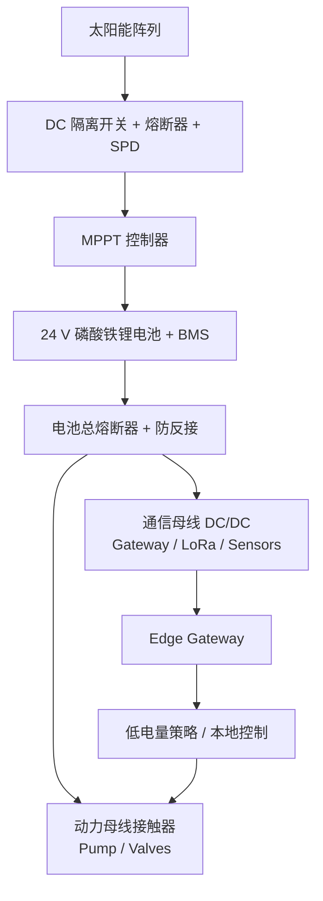

# AgriOS 野外太阳能供电设计

> 版本：Phase28 / 现场设计基线
> 适用范围：无市电、无人值守的边缘网关、LoRa 节点和有限时长灌溉负载。施工前必须用最终设备铭牌、泵扬程/流量和当地最差月太阳辐照重新核算。

## 1. 系统拓扑

通信母线与动力母线必须独立保护。网关、传感器和急停回路保持供电优先级最高；水泵不得与网关共用未经隔离的细线、接插件或 DC/DC。较大水泵宜使用独立光伏阵列/电池，或直接太阳能泵控制器。

## 2. 设计输入与计算方法

- 每日能耗：`E_day(Wh) = Σ 平均功率(W) × 每日运行小时(h)`。
- 冬季光伏发电量：`E_pv = 阵列功率 × 最差月峰值日照小时 × 系统折减系数`。
- 本设计初算采用 3.5 h 峰值日照、0.70 综合折减；项目地点确认后换成当地最差月数据。
- 电池标称容量：`C_Wh = E_day × 自治天数 ÷ (允许放电深度 × DC效率)`。
- LiFePO4 初算采用 80% DoD、90% DC 效率。24 V 系统按 25.6 V 标称计算。

### 2.1 典型负载

| 负载 | 设计功耗/工况 | 说明 |
|---|---:|---|
| Edge Gateway + LoRaWAN | 5–12 W 平均，15–25 W 峰值 | 4G 发射时有短时峰值；应以实测 24 h 曲线为准 |
| LoRa 田间节点 | 0.05–0.5 W 平均/节点 | 深睡眠、采样和发射占空比决定平均值 |
| 传感器/阀控制待机 | 1–3 W 合计 | RS485 探头可按需上电 |
| 4G 回传 | 已计入网关时仍预留 3–8 W 峰值 | 弱信号会增加发射功耗和重连次数 |
| 24 V 电磁阀 | 5–15 W/只，动作期间 | 灰度阶段只开一个 Zone |
| 水泵 | 250 W–数 kW | 必须按实泵输入功率和日运行时间独立核算 |

## 3. 100 W / 200 W / 300 W 方案比较

以下为架构选择示例，不是采购铭牌替代品。

| 方案 | 示例每日负载 | 冬季可发电量 | 建议电池 | 预计自治 | 适用边界 |
|---|---:|---:|---:|---:|---|
| 100 W | 170 Wh | 245 Wh/day | 25.6 V 30 Ah（768 Wh） | 约 3.2 天 | 网关 + 少量节点；禁止带水泵 |
| 200 W | 339 Wh（含 250 W 泵 15 min） | 490 Wh/day | 25.6 V 50 Ah（1.28 kWh） | 约 2.7 天 | 小菜园短时泵测；连续阴雨余量有限 |
| 300 W | 546 Wh（含 360 W 泵 30 min） | 735 Wh/day | 25.6 V 100 Ah（2.56 kWh） | 约 3.4 天 | 300 亩网关站最低建议级别；仅支持有限泵负载 |

300 亩基地推荐每个通信站从 **300 W + 25.6 V 100 Ah** 起步，并根据最差月实测提高到 400–600 W。若水泵超过 500 W 或每日运行超过 30 分钟，应把泵站作为独立能源工程核算，常见会进入 0.8–数 kW 光伏等级；不能简单放大通信站方案。

## 4. 关键器件选型

| 部件 | 选型要求 |
|---|---|
| 光伏组件 | 单晶、IEC 合规、耐 PID；串并联后开路电压在最低温度下仍低于 MPPT 上限 |
| MPPT | 24 V、具备温度补偿/远程状态；100/200/300 W 分别不小于 10/15/20 A，另留 ≥25% 余量 |
| 电池 | 25.6 V LiFePO4，带低温充电保护、过流/短路 BMS；箱体留膨胀与检修空间 |
| DC/DC | 宽输入、隔离型优先；网关输出预留两倍短时功率，低压侧独立熔断 |
| 保护 | PV 侧隔离、支路熔断、II 级 DC SPD；电池正极靠近端子设置 DC 额定熔断器 |
| 线缆 | 室外耐 UV，按载流量和压降核算；通信母线建议压降 ≤3%，动力回路 ≤5% |

保险丝按“保护导线而非保护设备”的原则选择：额定值高于最大持续电流、低于导线允许电流，并确认 DC 分断能力。不得用 AC 断路器替代未标明 DC 额定值的器件。

## 5. 机械、防雷与防水

- 阵列朝正南布置，初始倾角按当地纬度；用最差月发电量而非全年平均值校核。
- 光伏架构按当地最大风速、雪载和土壤条件设计；基础与天线杆不得互相遮挡或形成松动风险。
- 控制箱至少 IP65，电池箱通风方式符合电池厂家要求；电缆入口向下，使用匹配线径的防水格兰头并做滴水弯。
- 天线杆、组件框架、箱体 PE 和 SPD 接入等电位系统；接地和防雷由有资质人员按当地规范实施。
- 所有端子标注电压、极性、回路号；正负极使用不同颜色且设置机械防反插连接器。

## 6. 能源感知运行策略

| SOC/状态 | AgriOS Edge 行为 |
|---|---|
| ≥40% | 正常采样、4G 回传和灌溉 |
| 25–40% | 降低非关键遥测频率；延迟批量补传；禁止非必要人工灌溉 |
| 15–25% | 保持网关、告警和安全关闭；禁止自动启动水泵 |
| <15% | 关闭泵阀动力母线，只维持低频心跳和本地日志；生成低电量严重告警 |
| BMS 切断/电压异常 | 默认所有阀门常闭；恢复后要求现场/规则双重校验才允许泵启动 |

SOC 阈值必须通过设备能力配置下发，并在网关离线时继续生效。水泵启动前检查电池电压、SOC、预计运行能耗和最近太阳能充电状态；启动后监测母线压降，跌破保护阈值立即停泵。

## 7. 调试与验收

1. 断开全部负载，核对 PV 极性、开路电压、绝缘和接地。
2. 先接电池再接 PV（或严格遵循 MPPT 厂家顺序），验证充电阶段和电流方向。
3. 逐个接入通信负载，记录静态、4G 发射和 LoRa 接收峰值功耗。
4. 独立测试阀门，再带水测试泵；记录启动电流、母线最低电压和 30 分钟温升。
5. 模拟连续阴雨：禁止 PV 输入，验证 SOC 分级策略、低电量告警和泵启动闭锁。
6. 连续记录至少 7 天的发电量、耗电量、SOC、最低电压和掉电事件，达到能源平衡后签字。

竣工资料必须包含最终负载表、最差月辐照来源、线径/保护计算、器件铭牌、接地测试、7 天能量曲线和电池可用容量测试。
