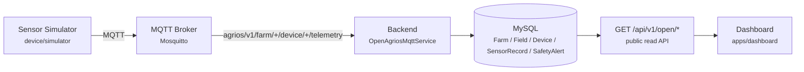

# OpenAgriOS v0.1-alpha — Release Audit

Status: **Ready for public GitHub release**, verified end-to-end against a fresh Docker
environment. This document is the release-time snapshot; `docs/AUDIT.md` remains the record of
the pre-implementation repository audit that shaped these decisions.

## Architecture overview

Every arrow is real and running in this release — no mocked stage. Five Docker services:
`mysql`, `mqtt` (Mosquitto), `backend`, `simulator`, `dashboard`. Full detail:
[`docs/architecture.md`](architecture.md); full MQTT contract: [`docs/mqtt-spec.md`](mqtt-spec.md).

This is a small, public, unauthenticated slice of the existing, much larger AgriOS backend, not a
rewrite of it. The full platform (safety-gated device control, ThingsBoard sync, GIS, drone data,
irrigation engineering, multi-tenant auth) continues running untouched for authenticated users —
see [`docs/DEVELOPMENT_LOG.md`](DEVELOPMENT_LOG.md). See [`docs/AUDIT.md`](AUDIT.md) for the
entity-reuse and topic-isolation rationale.

## Completed features

| Area | What ships in v0.1-alpha |
|---|---|
| Digital twin entities | Farm → Field → Device → Telemetry → Alert, all on existing Prisma models (`Farm`, `Field`, `Device`, `SensorRecord`, `SafetyAlert`) — zero new tables |
| MQTT ingestion | `OpenAgriosMqttService` subscribes `agrios/v1/farm/+/device/+/telemetry`, validates payloads, auto-registers unknown devices, writes `SensorRecord`, marks devices online/offline |
| Alerting | Fixed-threshold alerts: soil moisture < 20%, battery < 15%, device silent > 30s — deduplicated, written to `SafetyAlert` |
| Public REST API | `GET /api/v1/open/farms`, `/farms/:id/fields`, `/fields/:id/devices`, `/devices/:id/telemetry/{latest,history}`, `/farms/:id/alerts`, `/farms/:id/snapshot` — unauthenticated, read-only |
| Sensor Simulator | `device/simulator` — standalone Node/MQTT publisher, soil moisture/temperature/humidity/battery/online status every 5s, zero hardware |
| Dashboard | `apps/dashboard` — static HTML/CSS/vanilla JS, no build step, no auth, polls the snapshot endpoint every 5s |
| Deployment | `docker compose up` — one command brings up MySQL, Mosquitto, backend (schema + demo seed automatic), simulator, dashboard |
| Documentation | `README.md`, `CONTRIBUTING.md`, `ROADMAP.md`, `CHANGELOG.md`, `LICENSE` (Apache-2.0), `docs/architecture.md`, `docs/mqtt-spec.md`, `docs/AUDIT.md` |

## Known limitations

Documented honestly, not silently — these are release-scope decisions, not unnoticed gaps.

- **Local demo security posture.** The Mosquitto broker runs `allow_anonymous true` and the new
  `/api/v1/open/*` endpoints have no authentication. Correct for a local alpha demo; explicitly
  **not** appropriate for a public-internet deployment as-is. Real per-device MQTT credentials/ACLs
  are a Phase 2 item (`ROADMAP.md`).
- **MySQL, not PostgreSQL.** The existing schema, ~30 migrations, and seed tooling are all MySQL.
  Deviates from the literal release brief's Docker service list; see `docs/AUDIT.md` for why
  swapping databases was judged out of scope for this release.
- **Fresh-database bootstrap uses `prisma db push`, not `prisma migrate deploy`.** A pre-existing
  gap in the migration history (`20260629000300_p3_traceability` references tables not yet created
  earlier in the chain) makes `migrate deploy` fail on a truly empty database. `db push` builds
  directly from `prisma/schema.prisma` and sidesteps this without editing migration files. This is
  a known, tracked limitation of the underlying migration history, not something this release
  fixes — a real `migrate deploy` path is needed before this becomes a production deployment
  story, not just a demo one.
- **No idempotency envelope on telemetry.** The MQTT payload has no `messageId`/`sequence`, so
  duplicate or out-of-order delivery isn't detected. Acceptable for a single simulated device
  publishing every 5s; noted in `docs/mqtt-spec.md` as a pre-`docs/architecture/
  AgriOS-MVP-Implementation-Plan.md`-recommended improvement for a later milestone.
- **Single-device demo path.** The `snapshot` endpoint returns the *first* field and *first*
  device for a farm — adequate for the one-farm/one-field/one-device alpha demo, not a real
  multi-device dashboard.
- **No automated test suite for the new module.** The new `open-agrios` module was verified by
  running the real Docker stack end-to-end (see below), not by an automated test file. A
  `scripts/verify-open-agrios.*` test in the existing `verify-*` pattern is a reasonable Phase 2
  follow-up.
- **Threshold alerts are fixed, not configurable.** 20%/15%/30s are hardcoded constants
  (`open-agrios.constants.ts`), intentionally not per-crop/per-field — this is a demo-grade alert,
  not the production decision engine.
- **No CI workflow.** There is no `.github/workflows/` in this release — the README's Build badge
  reflects this honestly rather than pointing at a workflow that doesn't exist. Adding CI (at
  minimum: backend typecheck, the `verify-*` script suite, and an `expo`/dashboard smoke check) is
  a reasonable Phase 2 follow-up, not a blocker for this alpha.

## Deployment verification

Performed for real against Docker Desktop on this machine, not assumed:

| Check | Result |
|---|---|
| `docker compose down -v` (wipe volume) then `docker compose up` from zero | **PASS** — full stack healthy in <40s |
| Backend schema sync (`prisma db push`) against a brand-new MySQL 8.4 container | **PASS** |
| OpenAgriOS demo seed (`Jingshan Farm` / `Onion Field 01` / `sensor-001`) | **PASS** — idempotent, re-run safe |
| Simulator → MQTT → Backend → `SensorRecord` ingestion | **PASS** — confirmed live values changing every 5s |
| `GET /api/v1/open/farms/openagrios-demo-farm/snapshot` (direct, port 3000) | **PASS** — 200, real data |
| Same endpoint through the dashboard's nginx reverse proxy (port 8080) | **PASS** — identical response |
| Dashboard static assets (`index.html`, `app.js`, `style.css`) served correctly | **PASS** |
| Existing production `MqttService` stays disabled (`DEVICE_CONTROL_MODE=MOCK`) | **PASS** — confirmed in backend boot log, untouched by this release |
| Continuous stability (stack left running, re-checked minutes later) | **PASS** — still serving fresh telemetry, no crash/restart |
| Visual browser screenshot of the dashboard | **NOT PERFORMED** — the in-app browser preview tool in this environment only attaches to servers it starts itself, not an externally-managed Docker container; verified instead via the exact HTTP path a browser would use (see above) |
| Standalone (non-Docker) `npm start` of `device/simulator` | **NOT PERFORMED** in this session — only the Dockerized path was exercised; the script itself is unchanged since being written and reviewed |
| Automated regression test for `open-agrios` module | **NOT WRITTEN** — see Known Limitations |

No destructive commands were run against any pre-existing data. The stack uses its own isolated
`openagrios-mysql-data` Docker volume, ports offset from the existing `docker-compose.p12.yml`
stack (3307 instead of 3306) to avoid collision, and its own container names — verified not to
interfere with the pre-existing (currently stopped) production-stack containers found on this
machine during the audit.

## Future roadmap

See [`ROADMAP.md`](../ROADMAP.md) for the full phase breakdown. Summary:

- **Phase 2** — ESP32/LoRa real hardware, replacing the simulator; per-device MQTT credentials.
- **Phase 3** — Edge agent, offline buffering, gateway support.
- **Phase 4** — AI agriculture assistant (prediction/decision support), building on the existing
  internal `AiDecisionModule`/`AiRecommendationModule`.
- **Phase 5** — Verified automatic control loop / smart irrigation, gated behind the platform's
  existing safety chain and an explicit safety review before merge.
