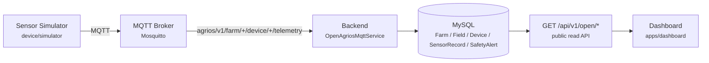

# OpenAgriOS Architecture — v0.1-alpha

This describes the alpha release's demo pipeline only. OpenAgriOS's full production backend is
much larger (safety-gated device control, ThingsBoard sync, GIS, drone data, irrigation
engineering — see `docs/DEVELOPMENT_LOG.md`); none of that is required to run or understand this
release.

## Digital twin concept

OpenAgriOS represents a physical farm as a chain of digital entities:

```
Farm -> Field -> Device -> Sensor reading (Telemetry) -> Dashboard
```

A `Device` becomes a "sensor" by its `type` (e.g. `SOIL_SENSOR`) — there is no separate `Sensor`
table. See `docs/AUDIT.md` for the full entity-reuse rationale.

## v0.1-alpha demo pipeline



Every arrow above is real and running in this release — there is no mocked stage in the demo
path.

## Component map

| Component | Path | Role |
|---|---|---|
| Sensor Simulator | `device/simulator/` | Publishes canonical telemetry every 5s — no hardware required |
| MQTT Broker | Mosquitto (Docker) | Transport only; the backend and simulator never talk directly |
| Backend ingestion | `apps/backend/src/modules/open-agrios/` | Validates, persists, raises simple threshold alerts |
| Database | MySQL (existing `apps/backend/prisma/schema.prisma`) | `Farm`, `Field`, `Device`, `SensorRecord`, `SafetyAlert` — all pre-existing models |
| Public read API | `GET /api/v1/open/...` | Unauthenticated, read-only — demo dashboard only |
| Dashboard | `apps/dashboard/` | Static HTML/JS, polls the snapshot endpoint |

## Why MySQL, not the ThingsBoard-adjacent Postgres

`docs/architecture/AgriOS-MVP-Implementation-Plan.md` (pre-existing) is explicit that ThingsBoard
and its Postgres instance are an optional IoT subsystem, not the application's database — AgriOS's
own business data has always lived in MySQL. The alpha does not introduce ThingsBoard at all; it
talks to the broker directly, so there is no Postgres in this release's path.

## What this release deliberately does not include

No device commands, no valve/pump control, no AI/LLM decision-making, no multi-tenant scoping on
the new `/api/v1/open/*` endpoints, no LoRa/ESP32 firmware. All of that already exists in the
underlying platform for authenticated, tenant-scoped users (see `docs/DEVELOPMENT_LOG.md`) — this
release is a minimal, public, unauthenticated slice for demonstration and contribution, not a
smaller rewrite of the platform. See `docs/roadmap.md` for what's next.
