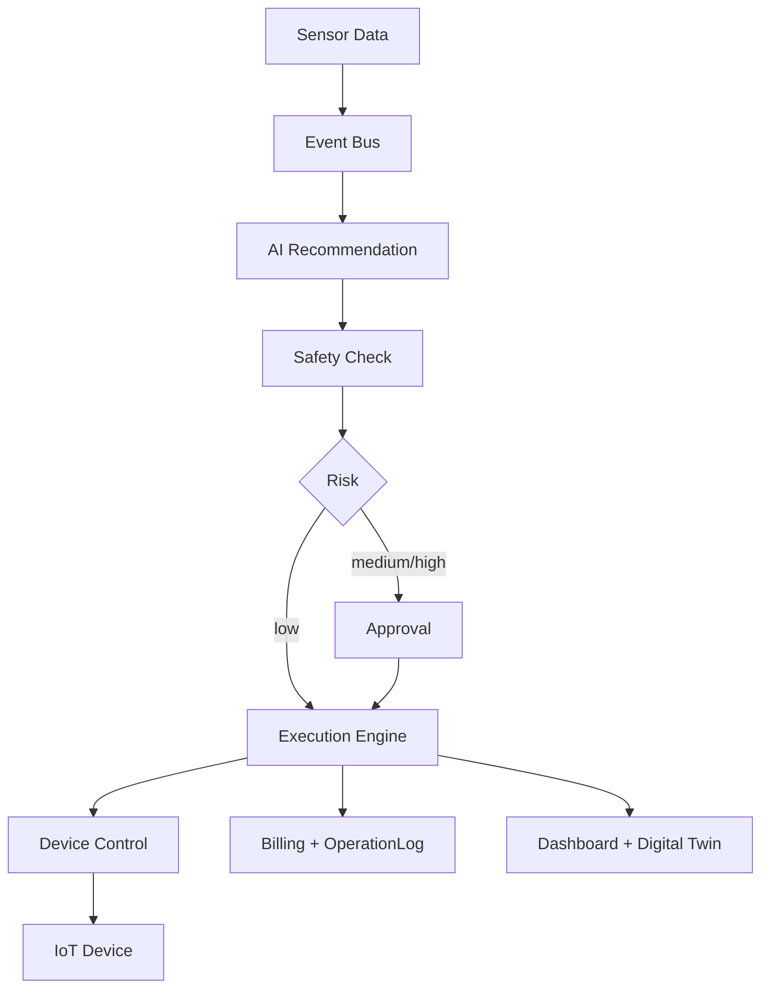

# AgriOS P11 商业化农业 AI 与 IoT 平台设计

P11 的目标是把前序 IoT、决策、灌溉闭环能力整理为可部署、可售卖、可审计的农业 SaaS 后端。P11 不是 AGI 实验系统，默认不绕过安全检查直接控制设备。

## 核心定位

- AgriOS 管农业业务、AI 建议、安全审批、商业计费和经营分析。
- ThingsBoard/MQTT 管设备接入、遥测上报和设备通道。
- 自动化执行必须经过安全风控；`AUTO` 模式默认关闭，需要显式设置 `ENABLE_AUTO_EXECUTION=true`。
- 生产环境建议保留人工确认或审批链路，尤其是泵、阀门、施肥等现场风险动作。

## 新增模块

- `tenant`：租户主体、`x-tenant-id` 上下文、中长期数据隔离基础。
- `billing`：用量记录、AI 决策计费、设备执行计费、租户汇总。
- `event-bus`：进程内事件总线，预留 Redis/Kafka 替换。
- `safety`：灌溉时长、用水量、湿度异常等安全检查。
- `approval`：中高风险操作转人工审批。
- `device-control`：设备控制抽象层，屏蔽底层 MQTT/厂商差异。
- `execution`：手动、辅助、自动三种执行模式。
- `ai-decision`：生产安全版 AI 农事建议入口。
- `dashboard`：农场 KPI 总览。
- `digital-twin`：地块灌溉影响预览。
- `iot/integration`：统一 IoT 适配层，支持 ThingsBoard、MQTT、模拟设备扩展。

## 执行流

## 安全原则

- AI 只生成建议，不直接绕过执行引擎。
- 执行动作统一经过 `SafetyService.check`。
- 安全不通过时创建审批请求，而不是强行下发设备命令。
- 人工手动停止始终保留，`PUMP_OFF` 不受自动模式开关限制。

## 商业化计量

P11 新增 `UsageRecord`，当前记录：

- `AI_DECISION`
- `IRRIGATION_ACTION`
- `DEVICE_EXECUTION`
- `DEVICE_ONLINE_DAY`
- `HECTARE_MONTH`

后续可基于 `SubscriptionPlan`、`BillingAccount`、`Invoice` 实现完整账单。

## 数据隔离

P11 已为核心业务表补充 `tenantId` 字段，并增加租户上下文能力。当前保持向后兼容，旧数据允许 `tenantId` 为空；生产迁移时建议执行数据回填。

## 下一阶段建议

- 把进程内 `EventBusService` 替换为 Redis Stream 或 Kafka。
- 给所有旧 CRUD 查询逐步补全强制 `tenantId` 过滤。
- 引入真实订阅套餐、账单周期和支付前置数据结构。
- 给自动执行增加设备失败自愈、阀门联动和紧急停机硬件闭锁。
